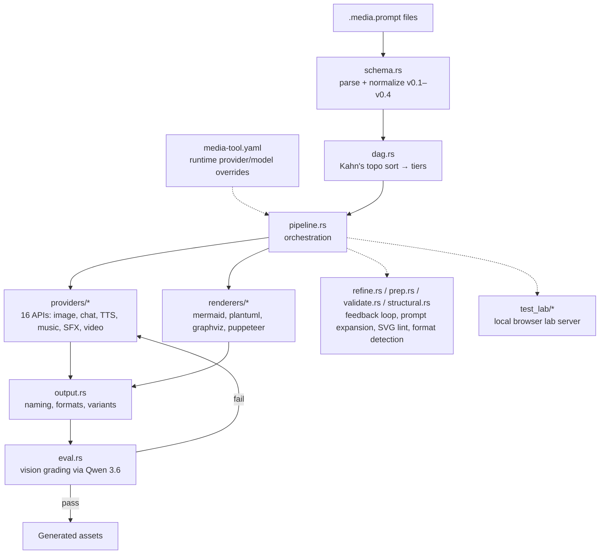

# Project Architecture

## Overview

**media-tool** is a terminal utility that generates media assets from declarative YAML prompt files (`.media.prompt`, asset-prompt-payload schema v0.4). Authors declare *intent* — asset type, quality tier, prompt text, acceptance criteria — and the tool owns everything else: provider auto-selection by quality tier, dependency-DAG ordering across prompt files, generation via 16 provider APIs, markup rendering, LLM-based eval grading with provider fallback, and interactive refinement.

The primary implementation is a single Rust binary (`generate-media-prompt`, built with clap/tokio/ratatui) installed to `~/.local/bin`. A legacy bash + Python engine (`bin/` + `lib/`) remains as an install fallback when `cargo` is absent. The repo also ships a **Phoenix + Hologram landing/documentation site** (`web/`, deployed via `helm/media-tool-landing`) and a **local test-lab web server** (`src/test_lab/`) for browser-driven prompt experiments. The tool is part of the wider Noizu utilities ecosystem: the bash wrapper follows k8-lib conventions (config resolution, logging), API keys fall back to the `.envrc.k8.dc` secrets layer at `$INFRA_ROOT`, and the eval system can reach an in-cluster inference proxy in the Noizu k8s cluster.

## System Diagram

## Core Components

| Component | Purpose |
|-----------|---------|
| `src/main.rs` | CLI entry (clap): input resolution, flag handling, pipeline dispatch |
| `src/schema.rs` | YAML parsing; normalizes legacy v0.1–v0.3 schemas to v0.4 |
| `src/provider_config.rs` | Loads `media-tool.yaml` (file or URL) — runtime overrides for defaults, tiers, limits |
| `src/structural.rs` | Structural format detection/normalization for markup assets |
| `src/dag.rs` | Dependency graph across prompt files; cycle detection, Kahn's algorithm, tier grouping |
| `src/pipeline.rs` | Orchestration: dry-run preview, execution, quality→provider selection, tier ordering |
| `src/providers/` | 16 `MediaProvider` implementations: Gemini/Imagen, Qwen/DashScope, ZAI, Suno, three TTS engines, six chat providers, Grok/Veo/Wan video |
| `src/renderers/` | Markup→visual transforms: Mermaid, PlantUML, Graphviz, Puppeteer screenshots |
| `src/test_lab/` | Local HTTP server + browser UI for interactive prompt lab (catalog, settings, persistence) |
| `src/eval.rs` | Weighted-criteria grading via OpenAI-compatible vision endpoint; drives provider fallback |
| `src/refine.rs` | Interactive loop: feedback → LLM prompt rewrite → in-place file update → regenerate |
| `src/prep.rs` | Prompt expansion per asset type via Groq LLM |
| `src/validate.rs` | Output validation (SVG lint with bounded auto-fix attempts) |
| `src/fim.rs` | Loads FIM solution library from `skill/content-media-engine/references/fim/` |
| `src/ui.rs` | ratatui TUI, indicatif progress, dialoguer prompts |
| `bin/` | Legacy bash wrapper (k8-lib sourcing) + `media-eval-port-forward` kubectl helper |
| `lib/media-prompt-engine.py` | Legacy single-file Python engine (stdlib + pyyaml, PEP 723) |
| `web/` | Phoenix 1.8 + Hologram landing/docs site (home, format, providers, extensibility pages) |
| `helm/media-tool-landing/` | Helm chart deploying the landing site (wraps static-site subchart) |
| `skill/content-media-engine/` | Claude Code skill packaging: SKILL.md, prompt templates, FIM library |
| `demos/` | Working `.media.prompt` examples per asset type (10 kinds incl. sfx, component, document) |

→ *Components ↔ directories: see [PROJ-LAYOUT.md](PROJ-LAYOUT.md)*

## Provider Architecture

Three provider categories, dispatched from a registry in `providers/mod.rs`:

1. **Media providers** (binary output): Gemini Imagen, Qwen image, DashScope, ZAI (image); Suno (music + SFX, async polling); OpenAI TTS, ElevenLabs, Qwen TTS (voice); Grok Video, Veo, Wan (video, async polling).
2. **Chat-completion providers** (text/code output): Gemini chat, Anthropic, OpenAI chat, Groq, OpenRouter, LiteLLM/ZAI — for React pages, HTML, SVG, diagrams, style guides.
3. **Renderers** (markup → visual, post-generation transforms): mmdc, plantuml, dot, Puppeteer screenshot.

All provider model defaults, quality-tier ladders, and prompt-length limits can be overridden at runtime via `media-tool.yaml` (local or remote URL) without rebuilding — see `src/provider_config.rs`.

Adding a provider = implement the `MediaProvider` trait + register in `mod.rs`.

→ *See [providers.md](providers.md) for the implementation guide and status tracker*

## Generation Flow

Prompts are parsed and normalized, `depends_on` references are resolved into a DAG (cycles abort), and assets generate tier by tier — dependency outputs substitute into dependent prompts via `${alias}` (collapse modes: `file`, `inline`, `context`). Each generation passes through output naming/format handling, then optional eval grading.

## Quality Selection & Eval

Authors declare `quality: low|medium|high` instead of pinning providers; the tool tries candidates in preference order (ladder from compiled-in defaults or `media-tool.yaml` `image_tiers`) and grades each output against the prompt's `eval` block (weighted criteria, `required_pass`, `reject_if`) using a hosted Qwen 3.6 vision model. Failing outputs trigger fallback to the next candidate provider; if all are exhausted the best-scoring output is kept with a warning. The evaluator endpoint is probed in order: `MEDIA_EVAL_BASE_URL` → LAN inference server → `noizu.server` forward → in-cluster `lmstudio-proxy` (platform-ai namespace) → local port-forward (`bin/media-eval-port-forward`).

→ *See [quality-selection-and-eval.md](quality-selection-and-eval.md) for the approved design*

## Test Lab

`src/test_lab/` runs a local HTTP server (`cargo run` subcommand serving `test_lab/static/`) that catalogs `.media.prompt` files in a workspace (`lab-workspace/`, gitignored, auto-created; legacy `tmp/live-eval/` is migrated), registers generated examples in `examples-index.yaml`, persists LLM settings to `settings.json`, and drives generation through the same pipeline/providers as the CLI — a browser-based companion to the TUI.

## Web Landing Site

`web/` is a Phoenix 1.8 + Hologram 0.10 app (bandit server) presenting the tool's documentation as interactive pages (home, format/schema, providers, extensibility/getting-started). It builds to a static-friendly container (`web/Dockerfile`) deployed by `helm/media-tool-landing` — separate lifecycle from the Rust CLI.

## Ecosystem Integration

- **Install**: `make install` builds the Rust release binary → `~/.local/bin/generate-media-prompt`; falls back to `install-legacy` (bash + Python to `~/.local/lib/media-tools`) when cargo is missing. Picked up by the repo-root `make install-utilities` flow.
- **k8-lib**: the legacy bash wrapper discovers `K8_LIB_DIR` (devops tree or `~/.local/share/k8-lib`) and sources `common.sh` for logging/config; `--config` maps to `K8_CONFIG`.
- **Secrets**: per-provider API keys (`GEMINI_API_KEY`, `SUNO_API_KEY`, `OPENAI_API_KEY`, `ELEVENLABS_API_KEY`, `DASHSCOPE_API_KEY`, `XAI_API_KEY`, …) resolve from env, then the `.envrc.k8.dc` direnv-config layer at `$INFRA_ROOT`.
- **Runtime config**: `media-tool.yaml` resolves in order `$MEDIA_TOOL_CONFIG` (path/URL) → `$MEDIA_TOOL_CONFIG_URL` → `./media-tool.yaml` → `~/.config/media-tool/media-tool.yaml`; absent keys fall back to compiled-in defaults.
- **Cluster**: eval can ride the in-cluster `lmstudio-proxy` service (kubectl context `noizu`), keeping grading available when the LAN inference host is unreachable.
- **Skills**: `skill/content-media-engine/` packages the tool as a Claude Code skill; the shared asset-prompt-payload schema lives in the monorepo's `skills/shared/`.

## Key Decisions

- **Rust rewrite over Python engine**: single static binary, TUI (`-r` interactive selection, zellij `-j` batch panes), async provider polling; Python engine retained only as no-cargo fallback.
- **Declarative YAML + quality tiers**: prompt files carry intent and acceptance criteria, not provider plumbing — `service:` pinning is the escape hatch, not the default.
- **Runtime config over recompilation**: model defaults/tiers/limits live behind `media-tool.yaml` so fleet behavior can change via a URL-served file, no rebuild.
- **DAG-first batch model**: cross-file dependencies are first-class (`depends_on` + collapse modes), enabling multi-asset compositions (logo → hero → animation).
- **Eval-gated generation**: LLM grading with provider fallback trades API cost for hands-off quality; degrades gracefully (skip eval) when no evaluator endpoint is reachable.
- **Renderers as post-transforms, not providers**: chat models emit markup; local CLI tools (mmdc, plantuml, dot, Puppeteer) turn it into visuals — cleanly separating generation from rendering.

## Known Gaps

Post-processing actions (resize, convert, optimize, crop, trim, normalize) are parsed but stubbed; within-tier parallelism, `collapse: inline`/`context` substitution, and some image providers (OpenAI, Stability, Replicate, local) are planned — see README "Remaining Work".
