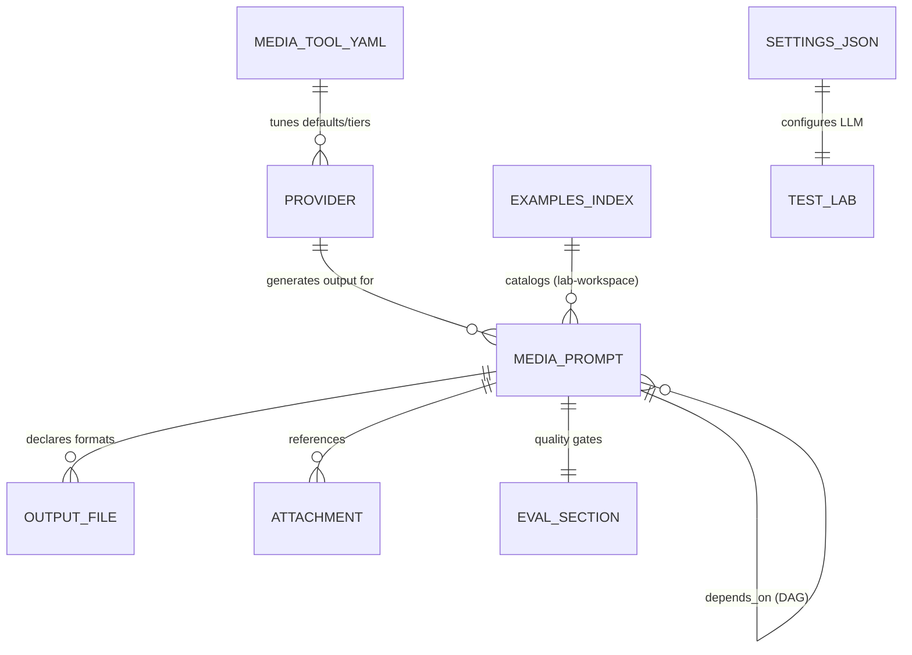
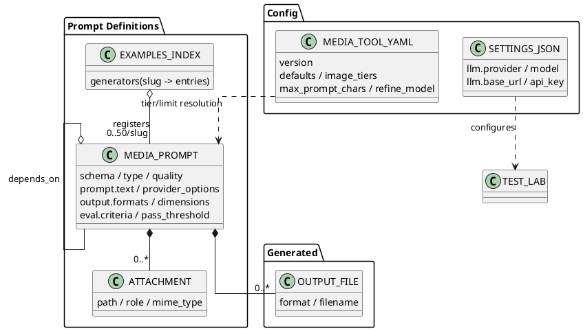

# Project Schema Reference

## Persistence Layer

**This project has NO database / SQL persistence layer.** There are no Liquibase
changelogs, migrations, or Ecto schemas. All persistence is:

1. **Flat files** — YAML prompt definitions (`.media.prompt`), runtime config
   (`media-tool.yaml`), test-lab workspace files (`settings.json`,
   `examples-index.yaml`)
2. **Environment variables** — provider API keys and endpoint overrides
3. **Generated outputs** — media files written beside the prompt file, plus
   cached generation artifacts (`.genai.*`)

This document is the single source of truth for all of those data formats.

---

## 1. `.media.prompt` YAML Prompt Schema

- **Files**: `*.media.prompt` (demos/, design-direction/, lab-workspace/prompts/)
- **Parser**: `src/schema.rs` (`PromptPayload` struct, serde_yaml)
- **Versions**: `schema: 0.1` (default) through `0.4`; v0.3/v0.4 map
  `prompt.tool_hints` → `prompt.provider_options`, v0.1/v0.2 normalize legacy
  `requirements:` into `output:` (normalization in `normalize_to_v03`)

### Top-level fields

| Field | Type | Required | Default | Description |
|-------|------|----------|---------|-------------|
| `schema` | string | No | `"0.1"` | Schema version (`0.1`–`0.4`) |
| `id` | string | No | filename stem | Stable identifier for DAG references |
| `type` | string | No | `"image"` | Asset type: `image`, `audio`, `voice`, `music`, `sfx`, `video`, `component`, `react-page`, `html`, `style-guide`, `diagram`, `document` |
| `service` | string | No | auto-select | Pin a provider (e.g. `gemini`, `suno`, `veo`) |
| `model` | string | No | service default | Pin a model id |
| `quality` | string | No | `"medium"` | Tier: `low` / `medium` / `high` (v0.4; picks image_tiers ladder) |
| `prompt` | map | No | — | Prompt section (below) |
| `output` | map | No | — | Output section (below) |
| `requirements` | map | No | — | **Legacy** (v0.1/v0.2): `format`, `dimensions` — migrated into `output` on parse |
| `attachments` | list | No | `[]` | File references (below) |
| `depends_on` | list | No | `[]` | DAG dependencies (below) |
| `post_processing` | list | No | `[]` | Post-gen steps: `{action, params}` (resize, convert, optimize, crop) |
| `eval` | map | No | — | Eval section (below) |
| `tags` | list | No | `[]` | Free-form tags |
| `product_targets` | list | No | `[]` | Product routing hints |

### `prompt` section

| Field | Type | Description |
|-------|------|-------------|
| `text` | string | Main prompt body |
| `negative` | string | Negative prompt |
| `style` | string | Style guidance |
| `system` | string | System-context prepended to each output |
| `provider_options` | map (free) | Service-specific options (v0.3+; absorbs legacy `tool_hints`) |
| `tool_hints` | map (free) | Legacy alias of `provider_options` |

### `output` section

| Field | Type | Description |
|-------|------|-------------|
| `formats` | list of maps | `{format, quality?, filename?, description?}` — `description` becomes a per-output generation prompt (multi-output briefs) |
| `dimensions` | map | `{width?, height?, aspect_ratio?}` |
| `transparency` | string | Transparency requirement |
| `color_space` | string | Color space requirement |
| `dpi` | u32 | DPI requirement |
| `diagram_type` | string | For `diagram` assets (mermaid/plantuml/graphviz) |
| `text_format` | string | Text output format |
| `duration` | float | Seconds for video/audio (alias: `length`) |

### `attachments` entries

| Field | Type | Default | Description |
|-------|------|---------|-------------|
| `path` | string | (required) | File path relative to the prompt file |
| `role` | string | `"reference"` | Attachment role |
| `mime_type` | string | auto-detected | Explicit MIME type |
| `description` | string | — | Human/LLM-facing description |

### `depends_on` entries

Untagged union:
- Simple form: plain string ref id (e.g. `hero-image`)
- Detailed form: `{ref, as?, collapse?}` — `as` renames the placeholder,
  `collapse` controls inlining mode (see `docs/howto/declare-dependencies-between-prompts.md`)

### `eval` section

| Field | Type | Default | Description |
|-------|------|---------|-------------|
| `pass_threshold` | float | `0.7` | Weighted score needed to pass |
| `max_attempts` | usize | provider-specific | Regeneration attempts |
| `required_pass` | list | `[]` | Criteria that must individually pass |
| `criteria` | map | `{}` | name → `{weight?, scale?, description?, fail_signals[]}` |
| `reject_if` | list | `[]` | Signals that force rejection |
| `mode` | string | `llm` | `llm` / `structural` / `hybrid` |
| `visual` | bool | `false` | Allow rasterization (Puppeteer/rsvg) for vision scoring |

---

## 2. `media-tool.yaml` — Runtime Provider/Model Config

- **File**: `media-tool.yaml` (repo root sample); user copies to cwd or
  `~/.config/media-tool/media-tool.yaml`
- **Parser**: `src/provider_config.rs` (`ProviderConfig`)
- **Resolution order** (first match wins; all optional, absent keys fall back to
  compiled-in defaults in `src/providers/mod.rs`):
  1. `$MEDIA_TOOL_CONFIG` — path to file **or** http(s) URL
  2. `$MEDIA_TOOL_CONFIG_URL` — http(s) URL
  3. `./media-tool.yaml` (cwd)
  4. `~/.config/media-tool/media-tool.yaml`

| Field | Type | Description |
|-------|------|-------------|
| `version` | u32 | Config format version (`1`) |
| `defaults` | map | service → default model id |
| `image_tiers` | map | `low`/`medium`/`high` → ordered `"service:model"` ladder, best-first; bare ids treated as gemini; **replaces** built-in ladder for that tier |
| `max_prompt_chars` | map | service → max prompt character limit |
| `refine_model` | string | Chat model for the refine loop |
| `prompt_guidance` | map | service → prompt-guidance doc path (relative to solutions dir) |

---

## 3. Test-Lab Workspace Files (generated, gitignored)

Written by `src/test_lab/` under `lab-workspace/` (or configured workspace
root). Legacy location `tmp/live-eval/` is auto-migrated.

### `settings.json` — Lab LLM settings (`LabSettings`)

```json
{
  "llm": {
    "provider": "<provider slug>",
    "model": "<model id>",
    "base_url": "<endpoint url>",
    "api_key": "<stored locally — never commit or document values>"
  }
}
```

Note: `api_key` is persisted to this local (gitignored) file by design — the
path is gitignored; do not copy `lab-workspace/` into shared locations.

### `examples-index.yaml` — Example catalog (`ExamplesIndex`)

| Field | Type | Description |
|-------|------|-------------|
| `version` | u32 | Index format version (`1`) |
| `generators` | map | generator slug → list of entries (capped at 50 per slug) |
| `updated_at` | string | RFC3339 timestamp, set on save |

Entry (`ExampleEntry`): `path` (workspace-relative when possible), `id`,
`generator_id`, `created_at` (RFC3339), `source` (e.g. `"workspace"`).

Slug inference from path: `prompts/fim/<generator>/x.media.prompt` →
`<generator>`; otherwise first path component; alternate `_`/`-` forms and
`fim:`/`kind:` prefixes are matched when looking up.

### Other workspace paths

- `prompts/**` — generated `.media.prompt` files (`fim/`, `prompts/`, `render/` subdirs)
- `outputs/**` — optional relocated binaries (generation usually writes beside the prompt)

---

## 4. Environment Variables (structure only — never commit values)

### Provider API keys (one per service, checked by `src/providers/*`)

| Variable | Service |
|----------|---------|
| `GEMINI_API_KEY` | Google Gemini / Imagen / Veo |
| `ANTHROPIC_API_KEY` | Anthropic Claude |
| `OPENAI_API_KEY` | OpenAI chat + TTS |
| `GROQ_API_KEY` | Groq chat (also prep expansion/vision) |
| `OPENROUTER_API_KEY` | OpenRouter gateway |
| `ZAI_API_KEY`-class / `LITELLM_API_KEY` | ZAI / LiteLLM proxy |
| `QWEN_API_KEY` / `DASHSCOPE_API_KEY` | Qwen image/TTS, Wan video (DashScope) |
| `SUNO_API_KEY` | Suno music/SFX |
| `ELEVENLABS_API_KEY` | ElevenLabs TTS |
| `XAI_API_KEY` | xAI Grok video |

### Behavior / endpoint overrides

| Variable | Purpose |
|----------|---------|
| `MEDIA_TOOL_CONFIG` | Config file path or http(s) URL (see §2) |
| `MEDIA_TOOL_CONFIG_URL` | Remote config URL fallback |
| `MEDIA_EVAL_API_KEY` / `MEDIA_EVAL_BASE_URL` / `MEDIA_EVAL_MODEL` / `MEDIA_EVAL_TIMEOUT` | Eval LLM endpoint override |
| `MEDIA_PREP_API_KEY` / `MEDIA_PREP_BASE_URL` / `MEDIA_PREP_MODEL` | Prompt-prep LLM endpoint override |
| `MEDIA_FIM_DIR` / `MEDIA_FIM_INJECT` | FIM solution dir / injection toggle |
| `GROQ_VISION_MODEL` | Vision model override for eval scoring |
| `INFRA_ROOT` | Monorepo root hint (bin/ wrapper) |

---

## 5. Web / Deploy Config (structure only)

- `web/config/{config,prod,runtime,test}.exs` — standard Phoenix Mix config
  (endpoint port/secret config arrives via `runtime.exs` env vars at deploy; no
  values committed)
- `helm/media-tool-landing/values.yaml` — image ref, replica/ingress knobs for
  the landing-site chart (wraps `charts/static-site` subchart)
- `web/mix.exs` — Elixir dependency pins (phoenix 1.8, hologram 0.10, bandit 1.x)

---

## Relationships (file/data flow)




