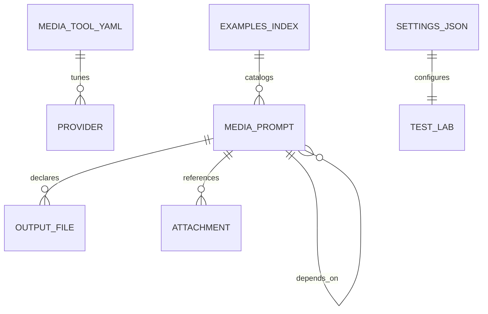

# Project Schema (Summary)

**No SQL/database persistence layer.** All data is flat files (YAML/JSON) + env
vars. Full details: [PROJ-SCHEMA.md](PROJ-SCHEMA.md)

| Artifact | Format | Owner module | Purpose |
|----------|--------|--------------|---------|
| `*.media.prompt` | YAML v0.1–v0.4 | `src/schema.rs` (PromptPayload) | Prompt definitions: type/service/model/quality, prompt, output, attachments, depends_on, post_processing, eval |
| `media-tool.yaml` | YAML v1 | `src/provider_config.rs` | Runtime provider/model overrides (defaults, image_tiers, max_prompt_chars, refine_model, prompt_guidance) |
| `lab-workspace/settings.json` | JSON | `src/test_lab/settings.rs` | Test-lab LLM settings (provider, model, base_url, api_key — local only) |
| `lab-workspace/examples-index.yaml` | YAML v1 | `src/test_lab/persist.rs` | Generator slug → prompt-file catalog (≤50/slug) |
| Env vars | — | `src/providers/*`, `main.rs` | API keys (`GEMINI_API_KEY`, `OPENAI_API_KEY`, `SUNO_API_KEY`, …), endpoint overrides (`MEDIA_EVAL_*`, `MEDIA_PREP_*`), config locations (`MEDIA_TOOL_CONFIG`, `MEDIA_TOOL_CONFIG_URL`) |
| `web/config/*.exs` | Elixir config | web app | Phoenix runtime config (secrets via env at deploy) |
| `helm/media-tool-landing/values.yaml` | YAML | helm chart | Landing-site deploy knobs |

## Key relationships

- `.media.prompt` assets: image, audio (music/voice/sfx), video, component, react-page, html, style-guide, diagram, document
- Config resolution: `$MEDIA_TOOL_CONFIG` → `$MEDIA_TOOL_CONFIG_URL` → `./media-tool.yaml` → `~/.config/media-tool/media-tool.yaml`; absent keys fall back to compiled-in defaults
- `lab-workspace/` is gitignored and generated at runtime (legacy `tmp/live-eval/` auto-migrated)
