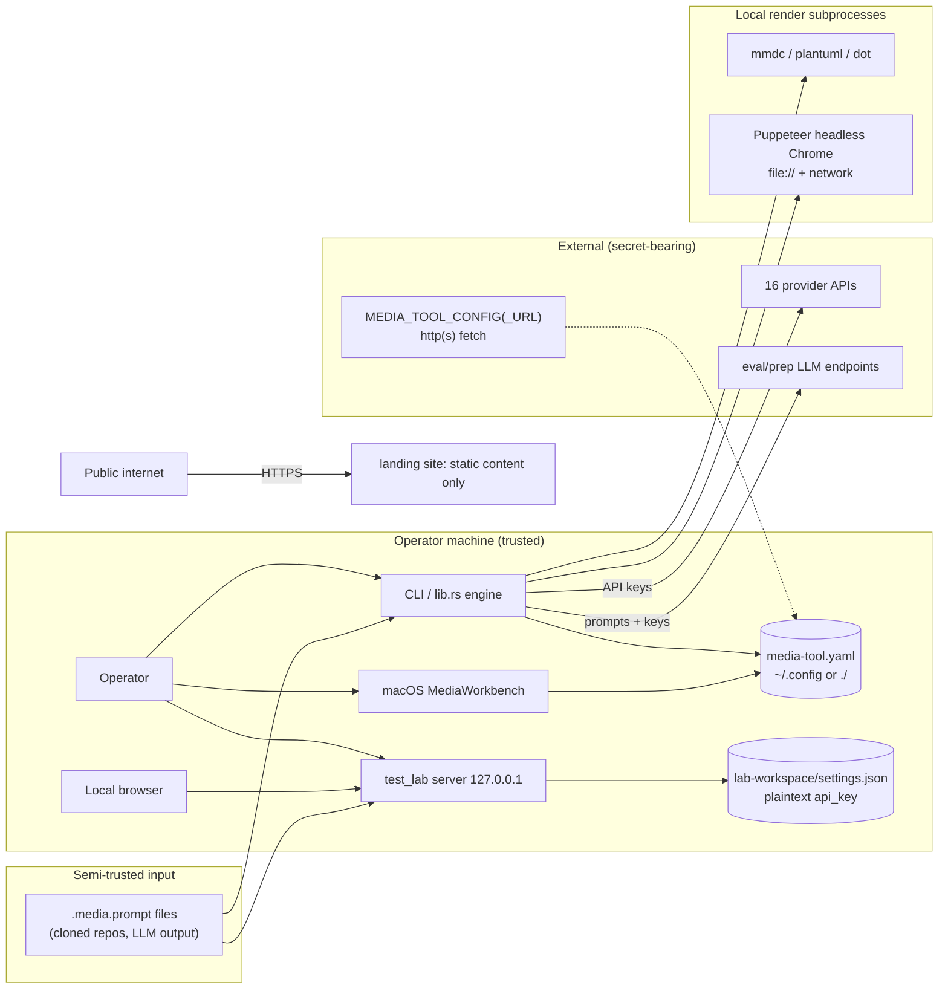

# Threat Model

## Overview

media-tool is a **local developer tool**, not a public service: the primary surface is a CLI run by a trusted operator, plus a loopback-only test-lab HTTP server and an in-progress macOS app. The crown jewels are **provider API keys** (env / `.envrc.k8.dc` / test-lab `settings.json`) and the operator's filesystem (prompt-declared output paths, attachment reads, renderer subprocesses). The main externally-facing artifact is the static landing site (`web/` + `helm/media-tool-landing`), which handles no secrets and authenticates nobody.

The distinctive risk shape: **prompt files are semi-trusted input that drives dangerous machinery** — they name output filenames, attachment paths, renderer binaries (`layout:`), and markup that Puppeteer/mmdc execute or render — while **runtime config can arrive over plain HTTP** and redirect provider traffic (and therefore API keys) to attacker-chosen endpoints.

Grounding: components and data flow in [PROJ-ARCH.md](PROJ-ARCH.md); implementing directories in [PROJ-LAYOUT.md](PROJ-LAYOUT.md).

## Attack Surface

## Trust Boundaries

1. **Internet → operator machine**: remote config fetch (`http://` allowed), provider/eval egress, and the deployed static site. Keys cross this boundary on every provider call.
2. **Prompt file → engine**: a `.media.prompt` from a cloned repo or LLM output is parsed and *acted on* — filenames, attachment paths, `layout:` binary names, rendered markup.
3. **Browser → loopback server**: the test lab has no authentication; any local webpage can attempt requests against `127.0.0.1:<port>`.
4. **Engine → local subprocesses**: renderers and post-processing execute local tooling over LLM-generated content.

## Vulnerability Register

| ID | Severity | STRIDE | Component | Status |
|----|----------|--------|-----------|--------|
| T-001 | High | Spoofing / Tampering / Info disclosure | Remote runtime config accepts plain `http://` (`provider_config.rs` fetch_url) — MITM can swap provider endpoints and harvest API keys | **Open** — enforce/refuse plain http, or sign/verify remote config |
| T-002 | Medium | Elevation of privilege | Graphviz renderer runs `Command::new(layout)` where `layout:` comes from the prompt file (`renderers/graphviz.rs`) — prompt author names any PATH executable | **Open** — allowlist (`dot`, `neato`, `circo`, …) |
| T-003 | Medium | Tampering / Info disclosure | Output `filename:` from a prompt is joined into the output dir without traversal checks (`output.rs`) — `../` can write outside it | **Open** — reject path separators / canonicalize + containment check |
| T-004 | Medium | Spoofing / Tampering | Test-lab server has no auth on POST/PUT routes (`/api/generate`, `/api/settings`) — drive-by local web pages can fire generation or rewrite LLM settings (incl. `base_url` key-redirection); CORS blocks reads, not side effects | **Open** — bind + random token, or require a custom header |
| T-005 | Medium | Info disclosure | Puppeteer renderer loads LLM-generated HTML via `file://` with `networkidle0` (`renderers/puppeteer.rs`) — generated content can make network egress and reference local files before the screenshot | **Partial** — headless, screenshot-only output, 30s timeout; no network/file lockdown |
| T-006 | Medium | Info disclosure | Test-lab `settings.json` persists `api_key` in plaintext (gitignored by design; `env:NAME` indirection exists) | **Partial** — local-only file, documented; env-reference form preferred |
| T-007 | Low | Info disclosure | `MEDIA_EVAL_*` / `MEDIA_PREP_*` base-URL overrides send prompts (and keys) to operator-chosen endpoints | **Accepted** — operator-controlled env vars by design |
| T-008 | Low | Info disclosure | `MEDIA_DEBUG=1` dumps raw provider HTTP bodies (keys, prompts) to the terminal | **Accepted** — opt-in debug affordance |
| T-009 | Low | Repudiation / DoS | Provider polling loops (Suno, Veo, Grok, Wan, Qwen async) | **Mitigated** — bounded retries/poll attempts/timeouts (`MEDIA_QWEN_*` knobs) |
| T-010 | Low | Spoofing | Landing site: static content, no auth, no secrets in image | **Mitigated** — nothing to spoof; standard ingress/TLS from static-site chart |

## Mitigation Coverage

2 mitigated · 2 partial · 2 accepted · 4 open.

Mitigation ↔ vulnerability map:

- Loopback-only bind (`server.rs` binds `127.0.0.1`) → narrows T-004 but does not close it (no auth)
- No-shell `Command::new` with fixed args in all renderers → contains T-002 to binary *name* choice only
- Gitignored `lab-workspace/` + `env:NAME` key indirection (`settings.rs`) → T-006
- Bounded polling/retry/timeout parameters on every async provider → T-009
- Headless Chrome + screenshot-only output + 30s goto timeout → T-005 (partial)

## Residual Risk

- T-007/T-008 accepted: both require deliberate operator action (setting env vars) in an already-trusted position.
- T-006 accepted-with-control: plaintext local key by design for lab ergonomics; the gitignore plus `env:` reference form are the compensating controls.
- Prompt files are treated as semi-trusted. Until T-002/T-003 close, running `.media.prompt` files from untrusted sources (cloned repos) is at the operator's risk — same trust call as running a repo's Makefile.
