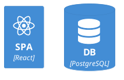
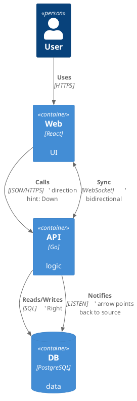
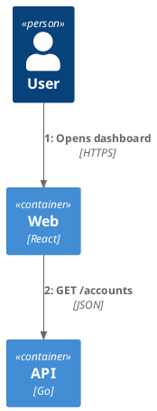
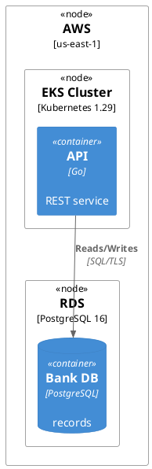
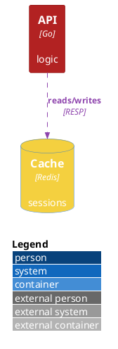
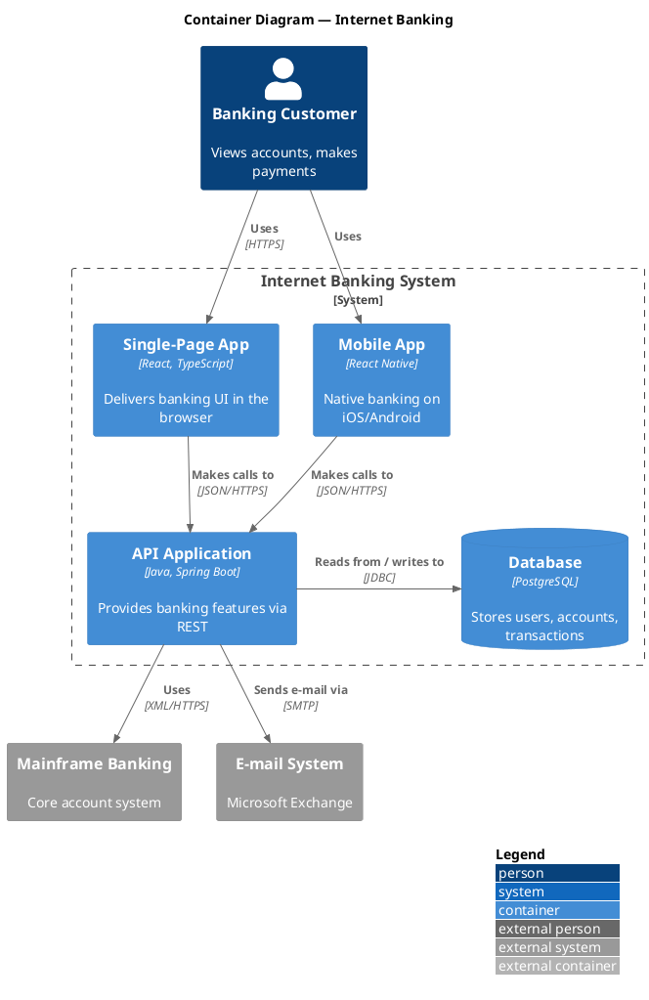
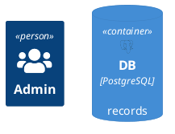

# C4-PlantUML — C4 Architecture Macros for PlantUML

C4-PlantUML is a PlantUML standard-library extension that renders the [C4 model](https://c4model.com) (Context, Container, Component, Code + Dynamic + Deployment) using purpose-built macros instead of raw UML shapes. You `!include` one C4 header, then call `Person(...)`, `System(...)`, `Container(...)`, `Rel(...)` etc. It keeps all the version-control and CI benefits of PlantUML while enforcing consistent C4 notation, colors, and legends.

**Current Version**: tracks PlantUML stdlib (C4-PlantUML v2.x)  **License**: MIT (the macro library)  **Runtime**: PlantUML engine (Java jar / server) + Graphviz `dot` for layout

## Official Resources & Documentation
- **Repository & docs**: https://github.com/plantuml-stdlib/C4-PlantUML
- **C4 model reference**: https://c4model.com
- **PlantUML stdlib**: https://github.com/plantuml/plantuml-stdlib (bundles `C4/*` under `<C4/...>`)
- **tupadr3 icon sets** (for sprites): https://github.com/tupadr3/plantuml-icon-font-sprites
- **Base engine docs**: https://plantuml.com

## Installation & Setup

### Include from the bundled standard library (recommended, offline-safe)
```plantuml
@startuml
!include <C4/C4_Container>
' also available: <C4/C4_Context>, <C4/C4_Component>,
'                 <C4/C4_Dynamic>, <C4/C4_Deployment>
@enduml
```
The `<C4/...>` angle-bracket form resolves against the PlantUML stdlib shipped with the jar/server — no network needed.

### Include from the GitHub raw URL (always latest)
```plantuml
@startuml
!include https://raw.githubusercontent.com/plantuml-stdlib/C4-PlantUML/master/C4_Container.puml
@enduml
```
Use this only when you need the newest macros and the runtime has network egress; vendor the file for locked-down CI.

### Icon/sprite includes (tupadr3 + logos)


### CLI render
```bash
java -jar plantuml.jar -tsvg architecture.puml   # needs Graphviz for layout
```

## Core Syntax / API Reference

### The five C4 headers (each unlocks its level)
| Include | Level / purpose |
|---------|-----------------|
| `<C4/C4_Context>` | System Context (level 1) |
| `<C4/C4_Container>` | Container (level 2) — also re-exports Context macros |
| `<C4/C4_Component>` | Component (level 3) — also re-exports Container macros |
| `<C4/C4_Dynamic>` | Dynamic diagram (numbered runtime interactions) |
| `<C4/C4_Deployment>` | Deployment diagram (nodes + instances) |

Including a deeper level generally re-exports the shallower macros, so `C4_Container` gives you `Person`/`System` too.

### Element macros
```plantuml
@startuml
!include <C4/C4_Container>

Person(customer, "Customer", "A retail banking customer")
Person_Ext(partner, "Partner", "Third-party integrator")

System(banking, "Internet Banking", "Lets customers view accounts")
System_Ext(email, "E-mail System", "Microsoft Exchange")
SystemDb(mainframe, "Mainframe", "Core banking records")
SystemQueue(bus, "Event Bus", "Kafka topic")

Container(spa, "Single-Page App", "React", "Delivers banking UI")
ContainerDb(db, "Database", "PostgreSQL", "Stores profiles, txns")
ContainerQueue(mq, "Message Queue", "RabbitMQ", "Async jobs")
Component(ctrl, "Sign-In Controller", "Spring MVC", "Handles auth")
@enduml
```
Signatures:
- `Person(alias, label, descr?)` / `Person_Ext(...)`
- `System(alias, label, descr?)` / `System_Ext` / `SystemDb` / `SystemQueue` (+ their `_Ext` forms)
- `Container(alias, label, technology, descr?)` / `ContainerDb` / `ContainerQueue`
- `Component(alias, label, technology, descr?)` / `ComponentDb` / `ComponentQueue`

Every element macro also accepts trailing named args: `$tags="..."`, `$sprite="..."`, `$link="url"`, `$baseShape="..."`.

### Boundaries
```plantuml
@startuml
!include <C4/C4_Container>
Enterprise_Boundary(ent, "Acme Corp") {
  System_Boundary(sys, "Banking Platform") {
    Container(api, "API", "Node.js", "REST facade")
    Container_Boundary(apiInternal, "API internals") {
      Component(router, "Router", "Express", "routes")
    }
  }
}
Boundary(generic, "Generic Group", "group") {
  Container(x, "X", "tech", "desc")
}
@enduml
```
`Enterprise_Boundary`, `System_Boundary`, `Container_Boundary`, and the generic `Boundary(alias, label, type?)` open a `{ ... }` block.

### Relationships

- `Rel(from, to, label, technology?)` — default routed arrow.
- Directional variants: `Rel_U`/`Rel_D`/`Rel_L`/`Rel_R` (Up/Down/Left/Right) bias layout.
- `BiRel(a, b, label, tech?)` two-headed; `Rel_Back` / `Rel_Back_Neighbor` reverse the head.
- `Rel_Neighbor` keeps elements adjacent.

### Layout & legend directives
```plantuml
@startuml
!include <C4/C4_Container>
LAYOUT_TOP_DOWN()        ' or LAYOUT_LEFT_RIGHT() / LAYOUT_LANDSCAPE()
LAYOUT_WITH_LEGEND()     ' auto legend from used tags
' SHOW_LEGEND()          ' explicit legend block (newer macro)
' SHOW_FLOATING_LEGEND()  + LEGEND() placement
@enduml
```

### Dynamic diagrams (numbered flow)


### Deployment diagrams

`Deployment_Node(alias, label, type, descr?)` nests; place `Container*`/`Component*` instances inside.

## Supported Diagram Types (full enumeration)
1. **System Context** (`C4_Context`) — people + software systems, black-box view.
2. **Container** (`C4_Container`) — apps/data stores inside a system.
3. **Component** (`C4_Component`) — components inside a container.
4. **Code** — C4's level 4; not a dedicated header — drop to plain PlantUML class diagrams (see `plantuml.md`) for this level.
5. **Dynamic** (`C4_Dynamic`) — numbered runtime collaboration.
6. **Deployment** (`C4_Deployment`) — infrastructure nodes and deployed instances.

## How-To (worked recipes)

### How to add colors, styling & themes (tags + Update*Style)
C4-PlantUML styles by **tag**: define a tag once, attach it to elements/relationships, then restyle every tagged item:

Key styling macros: `AddElementTag(name, $bgColor, $fontColor, $borderColor, $shape, $sprite, $legendText)`, `AddRelTag(name, $lineColor, $textColor, $lineStyle)`, `UpdateElementStyle(type, ...)`, `UpdateRelStyle(from?, to?, ...)`, `UpdateBoundaryStyle(...)`. Line styles: `DashedLine()`, `DottedLine()`, `BoldLine()`. Shapes: `RoundedBoxShape()`, `EightSidedShape()`.

### How to build a full Container diagram


### How to attach icons/sprites to elements

`$sprite="name,scale=…,color=…"` scales and tints the sprite. Include the sprite `.puml` before referencing it.

### How to control layout direction and legends
```plantuml
@startuml
!include <C4/C4_Context>
LAYOUT_LEFT_RIGHT()        ' switch to horizontal flow
Person(u, "User")
System(s, "System")
Rel_R(u, s, "uses")        ' Rel_R keeps them side-by-side
SHOW_LEGEND()              ' render the legend footer
@enduml
```
Combine `LAYOUT_*` with directional `Rel_U/D/L/R` and `Rel_Neighbor` to defeat awkward `dot` placement without manual coordinates.

## Do's and Don'ts

### ✅ Do
- `!include` exactly the level you need — the deeper header re-exports shallower macros (`C4_Container` includes `Person`/`System`).
- Give every element a stable `alias` and reference it in `Rel(...)` — never re-type the label.
- Style by **tag** (`AddElementTag` + `$tags=`) so a whole class of elements restyles in one place.
- Use `LAYOUT_WITH_LEGEND()` or `SHOW_LEGEND()` so readers can decode custom tag colors.
- Bias layout with `Rel_U/D/L/R` and `_Neighbor` variants rather than fighting the engine.
- Vendor the `C4_*.puml` files (or use the `<C4/...>` stdlib form) in locked-down CI instead of hitting GitHub raw at build time.

### ❌ Don't
- Don't mix raw PlantUML shapes (`class`, `[component]`) with C4 macros in the same diagram — it breaks the consistent C4 styling/legend.
- Don't forget `technology` on `Container`/`Component` — it's a positional arg and the diagram reads as incomplete without it.
- Don't call `Container(...)` after only including `C4_Context` — you'll get an "unknown procedure" error; include `C4_Container` or deeper.
- Don't expect a "Code" header — C4 level 4 falls back to standard UML class diagrams.
- Don't rely on network `!include` URLs in air-gapped or reproducible builds.
- Don't skip Graphviz — C4 diagrams route through `dot`; without it layout fails.

## Styling, Theming & Customization
- **Tag-based styling**: `AddElementTag` / `AddRelTag` / `AddBoundaryTag` define reusable named styles; attach via `$tags="tagA+tagB"`.
- **Direct restyle**: `UpdateElementStyle("person"|"system"|"container"|"component", $bgColor=…, $fontColor=…, $borderColor=…)`, `UpdateRelStyle(...)`, `UpdateBoundaryStyle(...)`, `UpdateLegendTitle("...")`.
- **Named args on elements**: `$bgColor`, `$fontColor`, `$borderColor`, `$shape`, `$sprite`, `$link`, `$legendText`, `$legendSprite`.
- **Line helpers**: `DashedLine()`, `DottedLine()`, `BoldLine()`, `$lineColor`, `$textColor`.
- **Underlying skinparam** still works — because C4-PlantUML is PlantUML, `skinparam`/`<style>` from `plantuml.md` apply for fonts, background, DPI, and shadows.

## Advanced Features
- **Dynamic numbering**: `SetIndex()`, `incrementIndex()`, `RelIndex(n, …)`, `LastIndex()` for ordered runtime flows.
- **Deployment nesting**: arbitrary `Deployment_Node` depth for regions → clusters → nodes → instances.
- **Sprites & icon fonts**: full tupadr3 (font-awesome, devicons, material) + `<logos/...>` + cloud icon sets.
- **Custom legends**: `SHOW_FLOATING_LEGEND()` + `LEGEND()` placement, `UpdateLegendTitle`, per-tag `$legendText`.
- **Composition**: share a `!include team-tags.puml` across many diagrams for org-wide consistent tag palettes.
- **Links**: `$link="https://…"` makes SVG elements clickable.

## Common Pitfalls & Troubleshooting
- **"Unknown procedure Container"** — you included `C4_Context` but used a Container macro; include `C4_Container`/`C4_Component`.
- **No layout / Graphviz error** — install Graphviz `dot`; C4 diagrams don't render with the pure-Java engine.
- **Network include fails in CI** — switch to `<C4/...>` stdlib includes or vendor the `.puml` locally.
- **Legend shows raw tag names** — supply `$legendText` in `AddElementTag`/`AddRelTag`.
- **Overlapping boxes** — add directional `Rel_*` hints and `_Neighbor` variants; consider `LAYOUT_LANDSCAPE()`.
- **Version mismatch** — some macros (`SHOW_LEGEND`, `SHOW_FLOATING_LEGEND`) are newer; pin your stdlib/jar version.

## Integration Notes
- Renders anywhere PlantUML does: MkDocs (`plantuml-markdown`), AsciiDoc (`asciidoctor-diagram`), GitLab, Confluence, VS Code (`jebbs.plantuml`).
- In CI, run `plantuml.jar` in a Docker image that already contains Graphviz (`plantuml/plantuml` image does).
- For model-as-code where one model drives many views automatically, prefer Structurizr DSL (`structurizr-dsl.md`), which can itself export to PlantUML.

## Best For / Avoid For
`c4-context`, `c4-container`, `c4-component`, `deployment-diagrams`, `dynamic-diagrams`, `architecture-docs`, `git-versioned-architecture`, `stdlib-icon-architecture`

Avoid for: non-C4 diagram types (use plain `plantuml.md`), C4 "Code" level (use UML class diagrams), or when you want a single model rendered as many auto-generated views (use `structurizr-dsl.md`).

## See Also
- [plantuml.md](plantuml.md) — the base engine, macros, skinparam, and all non-C4 diagram types
- [structurizr-dsl.md](structurizr-dsl.md) — model-as-code C4 with generated views (can export PlantUML)
- [uml-xmi.md](uml-xmi.md) — UML model interchange with modeling tools
- [mermaid.md](mermaid.md) — browser-native diagrams incl. a C4 dialect
- [graphviz.md](graphviz.md) — the DOT layout engine used under the hood
- [../use-case/diagram-generation.md](../use-case/diagram-generation.md) — choosing a diagram solution
- [../use-case/engineering-diagrams.md](../use-case/engineering-diagrams.md) — architecture/engineering diagram patterns
