# Graphviz DOT Language — Grammar & Attribute Syntax Deep-Dive

DOT is the declarative domain-specific language Graphviz reads to describe graphs. This file is the exhaustive *syntax* reference — statement types, quoting/escaping, HTML-like labels, the full node/edge/graph attribute surface, clusters, record labels, ports & compass points, ranking, and colors/gradients. For the toolchain, layout engines, and CLI see `graphviz.md`.

**Language**: DOT  **Renders via**: `dot`/`neato`/`fdp`/`sfdp`/`circo`/`twopi`/`osage`/`patchwork`  **File extension**: `.gv` (preferred) or `.dot`  **Grammar**: https://graphviz.org/doc/info/lang.html

## Official Resources & Documentation
- **Grammar**: https://graphviz.org/doc/info/lang.html
- **Attributes (authoritative list)**: https://graphviz.org/doc/info/attrs.html
- **Node shapes**: https://graphviz.org/doc/info/shapes.html
- **Arrow shapes**: https://graphviz.org/doc/info/arrows.html
- **Colors & schemes**: https://graphviz.org/doc/info/colors.html
- **Online editors**: https://dreampuf.github.io/GraphvizOnline , https://edotor.net
- **VS Code extension**: `joaompinto.vscode-graphviz`

## Setup
Rendering requires the Graphviz binaries (see `graphviz.md`):
```bash
brew install graphviz          # then: dot -Tsvg file.gv -o file.svg
```

## The Grammar

### Top-level form
```
[strict] (graph | digraph) [ID] '{' stmt_list '}'
```
- `graph` → undirected, edges use `--`. `digraph` → directed, edges use `->`.
- `strict` → collapse duplicate edges between the same node pair (and self-loops) into one.
- `ID` (the graph name) is optional.

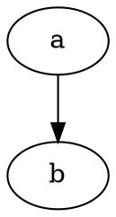

### Statement types (`stmt` in `stmt_list`)
A statement list is `;`-or-newline separated. The six statement kinds:

1. **`node_stmt`** — declare/attribute a node: `nodeID [attr=val, ...]`
2. **`edge_stmt`** — connect nodes: `a -> b -> c [attr=val, ...]`
3. **`attr_stmt`** — set scoped defaults: `graph [...]` | `node [...]` | `edge [...]`
4. **`ID = ID`** — set a single graph attribute: `rankdir=LR`
5. **`subgraph`** — `subgraph name { ... }` or anonymous `{ ... }`
6. **nested** — subgraphs may appear on either side of an edge.

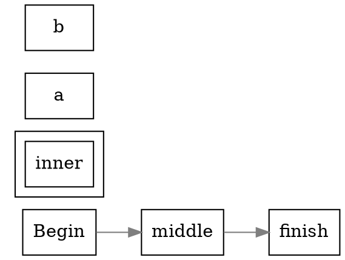

### Identifiers & quoting
An `ID` is one of:
- an alphanumeric string (letters, digits, `_`, not starting with a digit): `node1`, `my_node`
- a numeral: `3`, `-2.5`
- a **double-quoted string** `"..."` — required whenever the value contains spaces, punctuation, DOT keywords, or reserved characters: `"my node"`, `"a-b"`, `"graph"`
- an **HTML-like string** `<...>` — turns on HTML label parsing (see below)

Concatenate long quoted strings with `+`: `label="line one " + "continued"`.

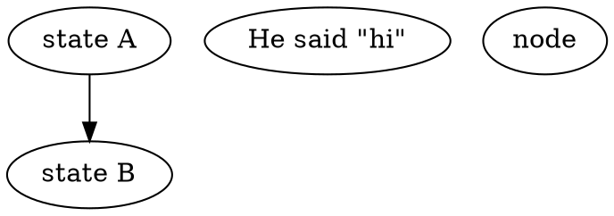

### Comments


## Escapes & Label Justification
Inside quoted labels these backslash escapes are special:
- `\n` — center-justified newline
- `\l` — left-justified line (each `\l`-terminated line hugs the left)
- `\r` — right-justified line
- `\N` — the node's name · `\G` — the graph's name · `\E` — the edge (`tail->head`) · `\H`/`\T` — head/tail node name · `\L` — the object's own label
- `\\` — literal backslash

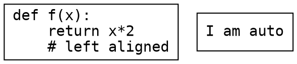
`\l` is the idiomatic choice for code/log blocks; `\n` centers each line.

## HTML-like Labels (`<...>` vs `"..."`)
A label delimited by angle brackets is parsed as an HTML-like label — a restricted table/font markup, *not* full HTML. It enables multi-cell tables, per-word fonts, colors, and images inside a node.

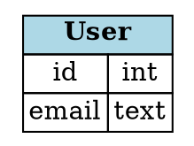
Supported tags include `<TABLE> <TR> <TD> <FONT> <B> <I> <U> <BR/>  <HR/> <VR/>`. Note: **HTML labels use `<...>` with no surrounding quotes**; wrapping them in `"..."` turns them into a literal string. `PORT="name"` on a `<TD>` creates an edge attachment point (see Ports).

## NODE Attributes

### `shape`
Polygon-based and special shapes. The common set:
`box`/`rect`/`rectangle`, `square`, `ellipse` (default), `oval`, `circle`, `point`, `triangle`, `invtriangle`, `diamond`, `trapezium`, `parallelogram`, `house`, `pentagon`, `hexagon`, `septagon`, `octagon`, `doublecircle`, `doubleoctagon`, `tripleoctagon`, `Mdiamond`, `Msquare`, `Mcircle`, `plaintext`/`none`, `note`, `tab`, `folder`, `component`, `box3d`, `cylinder`, `star`, `cds`, and the structured `record` / `Mrecord`.

Polygon shape is also generated from `shape=polygon` + `sides`, `skew`, `distortion`, `regular`, `orientation`, `peripheries`.

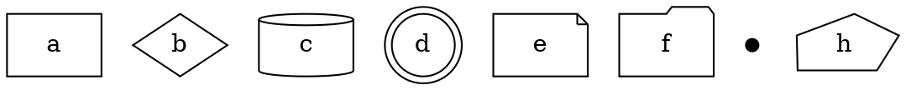

### Core node attribute reference
| Attribute | Meaning / values |
|-----------|------------------|
| `label` | Text (or `<...>` HTML, or record string). `\N` = node name (default). |
| `xlabel` | External label placed beside the node. |
| `color` | Border color (or fill outline). |
| `fillcolor` | Interior fill (requires `style=filled`). Accepts colorList for gradient/stripe. |
| `fontcolor` / `fontname` / `fontsize` | Label text styling. |
| `style` | `filled, dashed, dotted, solid, bold, rounded, diagonals, striped, wedged, radial, invis`. Combine: `style="rounded,filled"`. |
| `width` / `height` | Minimum size in inches. |
| `fixedsize` | `true` = use exactly width×height, don't grow to fit label. |
| `penwidth` | Border thickness in points. |
| `peripheries` | Number of outline rings (0 removes border). |
| `margin` | Label inset, `"x,y"` in inches. |
| `tooltip` | Hover text (SVG/imagemap). |
| `URL` / `href` | Hyperlink (SVG/cmapx). |
| `target` | Link target frame (SVG). |
| `image` / `imagepos` / `imagescale` | Embed a raster/vector inside the node. |
| `group` | Nodes in the same group are kept vertically aligned (dot). |
| `pos` | `"x,y"` (or `"x,y!"` to pin) — coordinates; mostly for neato-family. |
| `rank` | (on a subgraph) `same`/`min`/`max`/`source`/`sink`. |

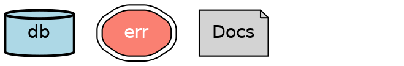

## EDGE Attributes

### Endpoints, direction, and arrows
| Attribute | Meaning / values |
|-----------|------------------|
| `label` | Edge text (placed near the middle). |
| `xlabel` | External/extra label, auto-placed to avoid overlap. |
| `headlabel` / `taillabel` | Text near the head / tail end. |
| `color` | Line color; a `:`-colorList draws **parallel multi-color** lines. |
| `fillcolor` | Arrowhead fill. |
| `style` | `solid, dashed, dotted, bold, invis, tapered`. |
| `penwidth` | Line thickness (points). |
| `arrowhead` / `arrowtail` | Arrow glyph at head/tail (see list). |
| `arrowsize` | Scale factor for arrows. |
| `dir` | `forward` (default for digraph), `back`, `both`, `none`. |
| `constraint` | `false` = edge does not affect rank assignment. |
| `weight` | Higher = straighter/shorter; pulls endpoints together (dot). |
| `minlen` | Minimum rank span between endpoints (dot). |
| `headport` / `tailport` | Attach to a record port or compass point. |
| `lhead` / `ltail` | Clip edge at a **cluster** boundary (needs `compound=true`). |
| `samehead` / `sametail` | Edges sharing a value aggregate at one point. |
| `decorate` | Draw a line from label to its edge. |
| `tooltip` / `URL` / `href` | Interactivity (SVG/imagemap). |

### Arrowhead glyphs (`arrowhead` / `arrowtail`)
Primitives: `normal` (default), `vee`, `dot`, `odot`, `diamond`, `ediamond`, `box`, `obox`, `crow`, `tee`, `inv`, `invdot`, `none`, `open`, `empty`, `halfopen`, `curve`, `icurve`. Modifiers `o` (open) and `l`/`r` (left/right half) combine, and up to four can be stacked: `arrowhead="invdot"`, `arrowhead="veevee"`, `arrowhead="lteeobox"`.

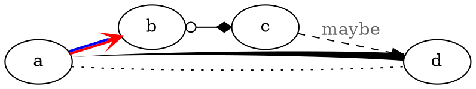

## GRAPH Attributes
| Attribute | Meaning / values |
|-----------|------------------|
| `rankdir` | Layout axis: `TB` (default), `LR`, `BT`, `RL`. |
| `ranksep` | Space between ranks (inches); `"0.5 equally"` forces equal gaps. |
| `nodesep` | Min space between adjacent nodes in a rank. |
| `splines` | Edge routing: `true`/`spline`, `false`/`line`/`none`, `polyline`, `ortho`, `curved`. |
| `concentrate` | `true` merges parallel edges into shared trunks. |
| `ratio` | `fill`, `compress`, `expand`, `auto`, or a numeric aspect. |
| `size` | Max drawing size in inches (`"8,10"`; append `!` to force scale-up). |
| `bgcolor` | Background color; colorList => gradient (see Colors). |
| `label` / `labelloc` / `labeljust` | Graph caption + placement (`t`/`b`, `l`/`c`/`r`). |
| `pad` / `margin` | Padding around drawing / inside clusters. |
| `newrank` | `true` = global rank constraints across clusters. |
| `compound` | `true` = allow `lhead`/`ltail` cluster-boundary edges. |
| `ordering` | `out`/`in` = preserve edge order out of/into nodes. |
| `nodesep`,`ranksep`,`overlap`,`sep`,`start` | (neato/fdp family) spacing, overlap removal, seed. |
| `fontname`/`fontsize`/`fontcolor` | Defaults for the graph label. |
| `dpi` / `resolution` | Raster resolution. |

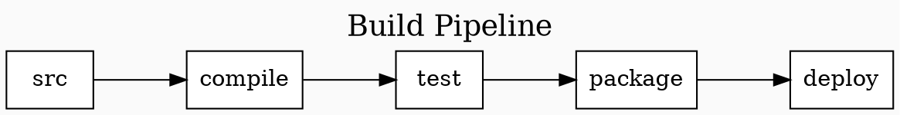

## Subgraphs & Clusters
A subgraph named with the reserved `cluster_` prefix is drawn as a labeled bounding box; any other subgraph name is a logical grouping only (for shared defaults or ranking). **The `cluster_` prefix is what turns a subgraph into a visible box** — omit it and you get no border.

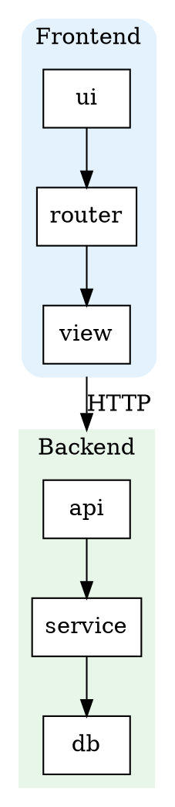
Clusters nest. `newrank=true` lets `rank=same` constraints cross cluster boundaries. Cluster-only attributes: `label`, `style`, `color`/`bgcolor`/`fillcolor`, `pencolor`, `labeljust`, `labelloc`.

## Record Labels
`shape=record` (or `Mrecord`, rounded corners) builds a node from `|`-separated fields; nesting flips orientation with `{ ... }`. Fields tagged `<name>` become **ports**.

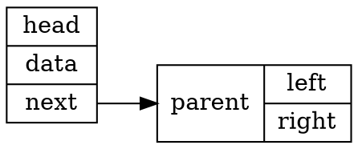
Orientation alternates with nesting and with `rankdir`: at top level under `rankdir=LR`, `|` splits **horizontally** and `{}` groups **vertically** (swapped under `TB`). Escape literal `|`, `{`, `}`, `<`, `>`, and spaces inside record text with a backslash.

## Ports & Compass Points
An edge endpoint can target a record port and/or a compass direction on the node's perimeter: `node:port:compass` or `node:compass`.

Compass points: `n`, `ne`, `e`, `se`, `s`, `sw`, `w`, `nw`, `c` (center), `_` (engine's choice).

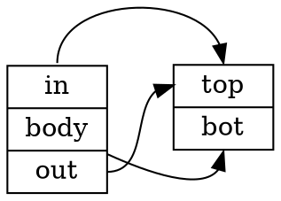
Compass control is handy for forcing self-loops and back-edges to exit/enter cleanly: `x:e -> x:w`.

## Ranking (same/min/max/source/sink)
Pin nodes onto shared or extreme ranks with an (anonymous) subgraph carrying a `rank` attribute:

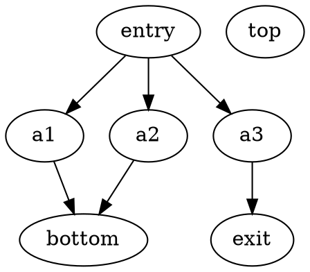
Combine with `constraint=false` on cross-edges so tie-lines don't distort the ranking, and `group=` on nodes to keep chains vertically aligned.

## Colors — the full syntax

### Named, hex, and HSV
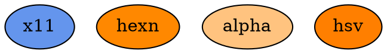
- **X11 names** (default): ~650 names, case-insensitive, `gray`/`grey` interchangeable, numbered grays `gray0`..`gray100`.
- **Hex**: `#RRGGBB`, `#RRGGBBAA` (alpha).
- **HSV**: `"H S V"` floats in 0–1.

### Colorschemes (SVG & Brewer)
Set the `colorscheme` attribute to change the active name space; then color names/indices resolve within it.
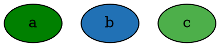
Brewer scheme names encode palette + size: `set19` (Set1, 9 colors), `paired12`, `blues9`, `rdylgn11`, `spectral11`, `dark28`, `accent8`, etc. Reference members by 1-based **integer** index. Sequential (`blues9`) for ordered data, qualitative (`set*`, `paired*`, `dark2*`, `accent*`) for categories, diverging (`rdylgn*`, `spectral*`) for above/below-midpoint.

### Gradient fills (`colorList` + `gradientangle`)
A colon-separated **colorList** in `fillcolor`/`bgcolor` produces a gradient; optional stop fractions place the transition; `gradientangle` sets direction; `style=radial` makes it radial.
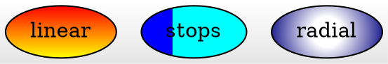

### Striped & wedged multi-color fills
With `style=striped` (rectangular shapes) or `style=wedged` (ellipse/circle), a `colorList` paints **discrete bands** instead of a smooth gradient. Weighted stops (`;fraction`) size each band.
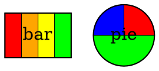

### Multi-color edges
An edge `color` colorList draws that many **parallel** lines; weighted stops split one line into colored segments.
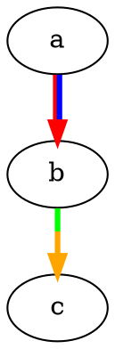

## How-To

### How to add colors, gradients & colorschemes (mandatory recipe)
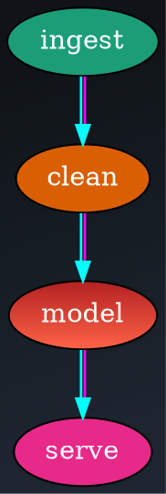
Checklist: `style=filled` before any `fillcolor`; `:`-list = gradient (node/graph) or parallel lines (edge); numeric colors need a live `colorscheme`; `style=striped`/`wedged` turns a gradient into discrete bands.

### How to build a database-schema node with a record label
```dot
digraph Schema {
  rankdir=LR;
  node [shape=record, fontname="Helvetica"];

  users [label="{ users | <id> id : int | email : text | <org> org_id : int }"];
  orgs  [label="{ orgs  | <id> id : int | name : text }"];

  users:org -> orgs:id [arrowhead=vee, label="FK"];
}
```
Ports (`<id>`, `<org>`) let foreign-key edges attach to the exact field row.

### How to draw cluster-to-cluster edges cleanly
```dot
digraph Compound {
  compound=true;                    // REQUIRED for lhead/ltail
  node [shape=box, style=filled, fillcolor=white];

  subgraph cluster_a { label="Service A"; color=steelblue; a1 -> a2; }
  subgraph cluster_b { label="Service B"; color=seagreen;  b1 -> b2; }

  a2 -> b1 [lhead=cluster_b, ltail=cluster_a, label="RPC"];  // clips at box edges
}
```

### How to route edges as right angles and pin nodes to one rank
```dot
digraph Ortho {
  rankdir=TB;
  splines=ortho;                    // orthogonal (right-angle) routing
  node [shape=box, style=filled, fillcolor=lightyellow];

  a -> b; a -> c; b -> d; c -> d;
  { rank=same; b; c; }              // b and c share a row
}
```

### How to control arrows, direction, and self-loops
```dot
digraph Arrows {
  rankdir=LR;
  x -> y [dir=both, arrowhead=diamond, arrowtail=odot];
  y -> z [arrowhead=veevee];        // stacked arrow primitives
  z -> z [headport=n, tailport=e, label="retry"];  // clean self-loop via ports
}
```

## Do's and Don'ts

### ✅ Do
- **Quote any ID with spaces, punctuation, or a keyword** — `"my node"`, `"end"` — bare unquoted values break the parser.
- **Set scoped defaults before the elements they apply to** — `node [...]` / `edge [...]` cascade to *subsequently declared* elements only.
- **Prefix grouping subgraphs with `cluster_`** when you want a visible box; plain subgraph names never draw a border.
- **Set `compound=true` before using `lhead`/`ltail`** for cluster-boundary edges.
- **Use ports (`node:port`) and compass points (`:e`, `:sw`)** to control exactly where edges attach — essential for records and tidy self-loops.
- **Use `style=filled` before `fillcolor`**, and give numeric Brewer colors a live `colorscheme`.
- **Escape record/label metacharacters** (`| { } < > \`) with a backslash when they're literal text.

### ❌ Don't
- **Don't use `->` in a `graph`** (or `--` in a `digraph`) — the operator must match the graph kind.
- **Don't set a default `node [...]` after the nodes** you expected it to style — it won't reach them retroactively.
- **Don't wrap an HTML-like label in quotes** — HTML labels use bare `<...>`; `"<...>"` becomes literal text.
- **Don't forget `PORT=`/`<name>` when you want to attach an edge to a table/record cell** — plain cells have no attachment handle.
- **Don't expect `constraint=false` edges to change ranks** — that's the point; use them for tie-lines and back-edges.
- **Don't rely on unquoted `#RRGGBB`** in every context — quote hex colors (`"#ff8800"`) to be safe, since `#` starts a preprocessor line at column 0.
- **Don't over-nest records** — deep `{ | { | } }` structures get hard to read and interact badly with `rankdir`; consider an HTML table label instead.

## Common Pitfalls & Troubleshooting
- **`fillcolor` ignored** → missing `style=filled`.
- **Numeric color shows as black/error** → no active `colorscheme` for that index.
- **Cluster edge lands on wrong node** → forgot `compound=true`, or `lhead`/`ltail` names don't exactly match the `cluster_*` subgraph name.
- **Record ports don't connect** → the `<name>` tag is missing, misspelled, or the field text wasn't escaped.
- **Label metacharacters render wrong** in records → escape `| { } < >`.
- **Style set on default node not applied** → declared the default *after* the node (scope cascades forward only).
- **HTML label prints angle brackets literally** → it was quoted (`"<table>…"`) instead of bracket-delimited (`<…>`).
- **`rankdir=LR` scrambled my record orientation** → `|` vs `{}` orientation swaps with `rankdir`; re-nest accordingly.
- **Graph too tall/skinny** → pipe through `unflatten -l3` before `dot` (see `graphviz.md`).

## Best For / Avoid For
**Best for**: `ast-visualization`, `database-schemas`, `infrastructure-topology`, `workflow-diagrams`, `hierarchy-trees`, `state-machines`, `dependency-graphs`, and any structure you can express as typed nodes + edges with rich per-element styling.

**Avoid for**: freeform illustration, precise manual layout, heavy interactivity, or non-graph diagrams (timelines, gantt, sheet-music) — reach for a purpose-built format instead.

## See Also
- `graphviz.md` — toolchain, layout engines (`dot`/`neato`/`fdp`/`sfdp`/`circo`/`twopi`/`osage`/`patchwork`), CLI, and ecosystem.
- `mermaid.md` — quick Markdown-embedded diagrams with themes; simpler but less layout control.
- `plantuml.md` — UML text diagrams; uses Graphviz for several layouts internally.
- `nomnoml.md` — lightweight sketch-style UML from text.
- `../use-case/diagram-generation.md` — choosing the right diagram format for a task.
- `../use-case/networks-graphs.md` — network/graph visualization patterns and engine selection.
