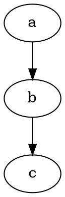
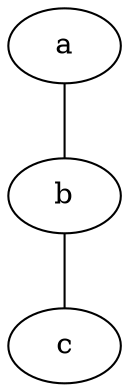
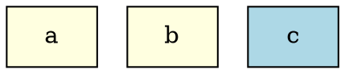
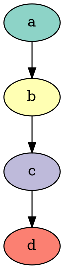
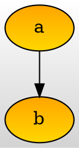
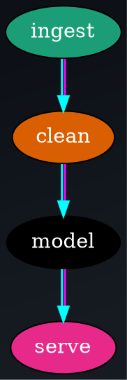
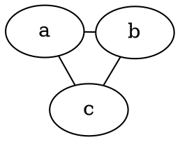
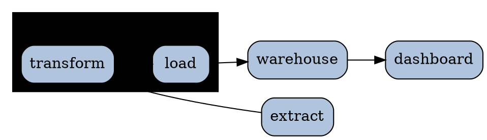

# Graphviz — Graph Visualization Toolchain & Layout Engines

Graphviz is the industry-standard open-source system for rendering directed and undirected graphs from a plain-text description written in the DOT language. You describe *what* connects to *what* (nodes and edges plus attributes); Graphviz's layout engines decide *where* everything goes and emit SVG, PNG, PDF, JSON, and more. This file is the conceptual/tooling reference — the engines, the CLI, the attribute model, and the ecosystem. For the raw DOT grammar (statement types, shapes, ports, records, gradients) see `graphviz-dot.md`.

**Current Version**: Graphviz 12.x (current major; 13.x in development)  **License**: Common Public License / EPL 1.0 (permissive)  **Runtime**: native C binaries (`dot`, `neato`, …); WASM builds (Viz.js / `@hpcc-js/wasm`) run in the browser.

## Official Resources & Documentation
- **Homepage**: https://graphviz.org
- **DOT language grammar**: https://graphviz.org/doc/info/lang.html
- **Attribute reference (authoritative)**: https://graphviz.org/doc/info/attrs.html
- **Node shapes**: https://graphviz.org/doc/info/shapes.html
- **Arrow shapes**: https://graphviz.org/doc/info/arrows.html
- **Colors & colorschemes**: https://graphviz.org/doc/info/colors.html
- **Command-line usage**: https://graphviz.org/doc/info/command.html
- **Gallery**: https://graphviz.org/gallery/
- **Source**: https://gitlab.com/graphviz/graphviz
- **Live editors**: https://dreampuf.github.io/GraphvizOnline , https://edotor.net
- **Python `graphviz` lib**: https://pypi.org/project/graphviz/ · **pygraphviz**: https://pygraphviz.github.io/
- **Browser (WASM)**: https://github.com/hpcc-systems/hpcc-js-wasm · **d3-graphviz**: https://github.com/magjac/d3-graphviz

## Installation & Setup

### System package managers
```bash
# macOS
brew install graphviz

# Debian / Ubuntu
sudo apt-get install graphviz

# Fedora / RHEL
sudo dnf install graphviz

# Windows
choco install graphviz        # or: winget install graphviz
```
Installing the package puts every layout engine on your PATH: `dot`, `neato`, `fdp`, `sfdp`, `circo`, `twopi`, `osage`, `patchwork`, plus helpers `gvpr`, `unflatten`, `acyclic`, `tred`, `ccomps`, `gc`, `dijkstra`, `nop`.

### Python
```bash
pip install graphviz        # thin subprocess wrapper around the CLI (needs the binaries)
pip install pygraphviz      # binds to the libcgraph/libgvc C libs (needs graphviz-dev headers)
```
The `graphviz` PyPI package shells out to the installed `dot` binary — install the system package too. `pygraphviz` compiles against the C library and gives you programmatic graph mutation.

### Browser / JavaScript (no native binary)
```html
<!-- @hpcc-js/wasm: the maintained WASM port of the full Graphviz engines -->
<script type="module">
  import { Graphviz } from "https://cdn.jsdelivr.net/npm/@hpcc-js/wasm/dist/graphviz.js";
  const graphviz = await Graphviz.load();
  document.body.innerHTML = graphviz.dot("digraph { a -> b -> c }");
</script>
```
`d3-graphviz` layers animated transitions on top of `@hpcc-js/wasm` for interactive web rendering. The older `viz.js` is deprecated in favor of `@hpcc-js/wasm`.

## The Toolchain: how a `.gv` becomes an image
1. You write a graph in **DOT** and save it as `.gv` (preferred) or `.dot`.
2. You pick a **layout engine** (`dot`, `neato`, …) — it computes coordinates.
3. You pick an **output format** with `-T` — the renderer emits the image.

```bash
dot -Tsvg diagram.gv -o diagram.svg
```
`dot` is both the name of the hierarchical engine *and* the historical name of the CLI, but every engine is its own binary. `dot -Kneato …` and `neato …` are equivalent.

## Layout Engines — the core decision

Choosing the engine matters more than any single attribute: it determines the entire spatial story. Set it via the CLI (`-K<engine>`) or inside the file (`layout=<engine>` graph attribute).

### `dot` — hierarchical / layered (directed acyclic flow)
Assigns nodes to discrete **ranks** and draws edges top-to-bottom (or L-R via `rankdir`). The default and correct choice for anything with direction: DAGs, flowcharts, dependency trees, org charts, state machines, call graphs, ASTs, pipelines.
```bash
dot -Tsvg tree.gv -o tree.svg
```
Use when: the graph has a natural flow/hierarchy. This is your default for `digraph`.

### `neato` — spring model / stress majorization (undirected)
Positions nodes so geometric distance approximates graph-theoretic distance (energy minimization). Good for small-to-medium undirected graphs where symmetry and clustering should emerge naturally.
```bash
neato -Tsvg network.gv -o network.svg
# or force-run neato layout on a digraph:
dot -Kneato -Tsvg network.gv -o network.svg
```
Use when: undirected relationship maps, ≤100 nodes, no inherent hierarchy.

### `fdp` — force-directed (larger undirected)
Fruchterman-Reingold-style force layout; handles clusters and scales further than `neato`. Supports `subgraph cluster_*` boxes in an undirected setting.
```bash
fdp -Tsvg mesh.gv -o mesh.svg
```
Use when: mid-size undirected graphs (hundreds of nodes) with clustering.

### `sfdp` — multiscale force-directed (very large)
A multilevel variant of `fdp` built for thousands of nodes. Pair it with overlap removal.
```bash
sfdp -Goverlap=prism -Tsvg huge.gv -o huge.svg
```
Use when: large graphs (1k–100k+ nodes) where you want *a* readable picture fast.

### `circo` — circular
Places nodes on circles, one per biconnected component. Ideal for ring topologies and cyclic structures.
```bash
circo -Tsvg ring.gv -o ring.svg
```
Use when: network rings, cyclic dependencies, telecom/topology layouts.

### `twopi` — radial
Concentric circles around a chosen `root` node; distance from center = graph distance.
```bash
twopi -Groot=core -Goverlap=false -Tsvg radial.gv -o radial.svg
```
Use when: one clear center (a hub, a root process) and everything radiates out.

### `osage` — clustered array
Lays out clusters as packed rectangles; nodes are arranged within their cluster box. Good for grouped inventories where inter-cluster edges matter less than grouping.
```bash
osage -Tsvg groups.gv -o groups.svg
```

### `patchwork` — squarified treemap
Renders the graph's cluster hierarchy as a space-filling treemap (area ∝ node/cluster size via the `area` attribute). Not a node-link diagram — a proportional map.
```bash
patchwork -Tsvg treemap.gv -o treemap.svg
```

### Engine quick-pick
| Need | Engine |
|------|--------|
| Directed flow / hierarchy / DAG | `dot` |
| Small undirected, show symmetry | `neato` |
| Medium undirected with clusters | `fdp` |
| Huge graph, just make it legible | `sfdp` (+ `overlap=prism`) |
| Ring / cyclic topology | `circo` |
| Radial around one root | `twopi` |
| Packed cluster boxes | `osage` |
| Proportional treemap | `patchwork` |

## The Command Line

```bash
dot -T<format> <input.gv> -o <output>      # canonical form
dot -Tpng in.gv -o out.png                 # explicit output file
dot -Tsvg -O in.gv                         # -O: auto-name -> in.gv.svg
cat in.gv | dot -Tsvg > out.svg            # read from stdin
dot -Kfdp -Tpdf in.gv -o out.pdf           # override engine with -K
```

### Output formats (`-T`)
| Format | Use |
|--------|-----|
| `svg`, `svgz` | Scalable, styleable, web-embeddable — **preferred for LLM/doc output** |
| `png`, `jpg`, `gif`, `bmp` | Raster; set DPI with `-Gdpi=150` |
| `pdf`, `ps`, `eps` | Print / vector |
| `json`, `json0`, `dot_json` | Machine-readable layout (coordinates + attributes) |
| `dot`, `xdot`, `canon`, `plain` | Round-trip: emit DOT *with computed coordinates* (`xdot`/`plain`) or canonicalized/pretty DOT |
| `cmapx`, `imap`, `ismap` | HTML client/server image maps (clickable regions from `URL`/`href` attrs) |
| `gv` | Pass-through |

List everything your build supports with `dot -Tsvg:` (prints valid renderers) or `dot -v`.

### Attribute overrides from the CLI (`-G` / `-N` / `-E`)
Inject graph/node/edge defaults without editing the file:
```bash
dot -Grankdir=LR -Nshape=box -Ecolor=gray50 -Tsvg in.gv -o out.svg
```
- `-G<name>=<val>` — graph attribute
- `-N<name>=<val>` — default node attribute
- `-E<name>=<val>` — default edge attribute

Useful for batch styling and for feeding one source through several looks.

### Diagnostic / transform helpers
```bash
unflatten -l3 in.gv | dot -Tsvg -o wide.gv.svg   # stagger leaves -> less tall/skinny
tred in.gv | dot -Tsvg -o out.svg                # transitive reduction (drop redundant edges)
acyclic in.gv                                    # reverse edges to break cycles for dot
ccomps -x in.gv                                  # split into connected components
gvpr -c 'N[outdegree==0]{...}' in.gv             # graph-pattern scanning/rewriting
```

## `graph` vs `digraph` and the connector operators
- `digraph { ... }` — **directed**; edges written with `->`; drawn with arrowheads.
- `graph { ... }` — **undirected**; edges written with `--`; no arrowheads.

Mixing them is a hard error: `->` inside a `graph` (or `--` inside a `digraph`) fails to parse. `strict` before the keyword collapses duplicate/parallel edges and self-multiedges into one. (Full grammar in `graphviz-dot.md`.)




## Core Concepts (conceptual — syntax lives in graphviz-dot.md)

### Ranks (the `dot` mental model)
`dot` sorts nodes into integer ranks and stacks them along the layout axis. Edges normally point from lower to higher rank; `rankdir` (`TB`/`LR`/`BT`/`RL`) rotates the axis; `ranksep`/`nodesep` control spacing. You pin nodes to the same rank with an anonymous subgraph `{ rank=same; a; b; }`. `constraint=false` on an edge lets it exist without influencing rank assignment (useful for back-edges).

### Clusters
A subgraph whose name begins with `cluster_` is drawn as a labeled bounding box, giving you visual grouping. Clusters can nest. To draw an edge that terminates on the cluster *boundary* rather than an inner node, set `compound=true` on the graph and use `lhead`/`ltail` on the edge.

### The attribute model (three scopes)
Every knob is an attribute attached to the **graph**, a **node**, or an **edge**. Defaults cascade: an `attr_stmt` like `node [shape=box, style=filled];` sets defaults for all *subsequently declared* nodes in the current subgraph scope. Per-element attributes override defaults. This scoping is the single most common source of "why didn't my style apply" confusion — a default set after a node is created does not retroactively style it.



## Colors & Colorschemes (concept level — full syntax in graphviz-dot.md)

Graphviz understands several color name spaces, and which one is active depends on the `colorscheme` attribute.

- **X11 names** (default scheme): `red`, `lightblue`, `gray80`, `cornflowerblue`, `firebrick`, … (~650 names). Case-insensitive; `grey`/`gray` both accepted.
- **SVG names**: switch with `colorscheme="svg"`. Overlapping-but-not-identical palette to X11 (notably `green` differs — SVG `green` is darker). Prefer SVG names when your output must match CSS/browser colors.
- **Hex**: `"#RRGGBB"` and `"#RRGGBBAA"` (alpha) always work regardless of scheme.
- **HSV**: three floats `"H S V"` in 0–1, e.g. `"0.6 0.5 0.9"`.
- **Brewer colorschemes** (ColorBrewer): set `colorscheme` to a scheme like `"set19"`, `"paired12"`, `"blues9"`, then reference colors by *index*: `color=3`, `fillcolor=7`. Great for categorical or sequential palettes that stay perceptually balanced.



Background and gradient fills are graph/node attributes:

A `radial` gradient is requested with `style="radial"` on the filled element. Multi-color node/edge `colorList` syntax (`"red:blue"`, weighted stops, striped/wedged fills) is detailed in `graphviz-dot.md`.

## Rendering Pitfalls & Performance

- **Wrong engine = wrong picture.** Running `neato` on a deep hierarchy produces a hairball; running `dot` on a symmetric mesh produces a lopsided ladder. Pick the engine first.
- **Tall, skinny `dot` output**: many leaf nodes hanging off one parent. Fix with `unflatten -l N` piped into `dot`, or by grouping siblings with `rank=same`.
- **Overlapping nodes in force layouts**: `neato`/`fdp`/`sfdp` may collide. Add `overlap=false` (slower, exact) or `overlap=prism` (fast, scalable) and consider `sep="+8"` for extra margin.
- **Large-graph blowups**: `dot` on tens of thousands of edges can be slow or run out of layout iterations. Reduce edge count with `tred` (transitive reduction), cap edge crossings/iterations with `nslimit`/`nslimit1` and `mclimit`, or switch to `sfdp`. `concentrate=true` merges parallel edges.
- **Splines cost time**: `splines=ortho`/`curved` are prettier but slower and can fail to route in dense graphs; `splines=line`/`false` is the fastest fallback.
- **Nondeterministic force layouts**: `neato`/`fdp` seed from node order; set `start=<seed>` for reproducible output.
- **Fonts**: if labels render in a fallback face, the named `fontname` isn't installed on the machine running `dot`. SVG output references the font by name (resolved by the viewer); PNG/PDF rasterize it at render time (must be installed then).

## How-To

### How to add colors, gradients & colorschemes
Fill nodes, tint edges, gradient the background, and switch to a Brewer palette:

Rule of thumb: `style=filled` is required before `fillcolor` shows; a `:`-separated color list makes a gradient (nodes/graph) or a multi-stripe (edges); a numeric color needs an active `colorscheme`.

### How to pick and force a layout engine
Author engine-agnostic DOT, then choose at render time — or pin it in the file:
```bash
dot    -Tsvg g.gv -o hierarchy.svg     # layered
neato  -Tsvg g.gv -o spring.svg        # spring
sfdp   -Goverlap=prism -Tsvg g.gv -o big.svg
```


### How to lay a flowchart left-to-right and group stages


### How to export SVG, PNG, and a clickable image map
```bash
dot -Tsvg site.gv -o site.svg                 # scalable vector
dot -Tpng -Gdpi=150 site.gv -o site@2x.png    # high-DPI raster
dot -Tcmapx site.gv -o site.map               # HTML <map> from URL= attrs
dot -Tpng site.gv -o site.png                 # pair the raster with the map
```
Give nodes/edges a `URL="https://…"` (a.k.a. `href`) attribute; SVG output makes them hyperlinks, and `cmapx` emits `<area>` regions for a raster ``.

### How to render DOT in the browser without native binaries
```html
<div id="graph"></div>
<script type="module">
  import { Graphviz } from "https://cdn.jsdelivr.net/npm/@hpcc-js/wasm/dist/graphviz.js";
  const gv = await Graphviz.load();
  document.getElementById("graph").innerHTML =
    gv.layout("digraph { a -> b -> c; a -> c }", "svg", "dot");
</script>
```
`gv.layout(dotSource, outputFormat, engine)` selects the engine at call time (`"dot"`, `"neato"`, `"fdp"`, `"sfdp"`, `"circo"`, `"twopi"`, `"osage"`, `"patchwork"`).

## Do's and Don'ts

### ✅ Do
- **Choose the engine to match the graph's nature first** — directed/hierarchical → `dot`; undirected/relational → `neato`/`fdp`/`sfdp`; ring → `circo`; radial → `twopi`.
- **Prefer SVG output** for docs and web — it scales, stays styleable, and keeps text selectable.
- **Set defaults before the nodes they should style** with `node [...]` / `edge [...]` attr statements; remember scope cascades downward, not backward.
- **Keep DOT engine-agnostic** and pick the engine at the CLI when you can — the same source can drive several looks via `-K` and `-G/-N/-E`.
- **Use `unflatten` / `tred` / `sfdp -Goverlap=prism`** as the standard fixes for skinny, redundant, or oversized graphs.
- **Use `.gv`** as the file extension (unambiguous; `.dot` collides with Microsoft Word templates on some systems).

### ❌ Don't
- **Don't mix `->` and `--`** with the wrong graph keyword — directed uses `->`, undirected uses `--`; the parser rejects the mismatch.
- **Don't expect to hand-place nodes.** Graphviz is a *layout* tool; absolute `pos="x,y!"` pinning fights the engine and usually breaks other constraints. If you need pixel control, use a drawing tool, not Graphviz.
- **Don't run `dot` on a large undirected mesh** and wonder why it's slow and ugly — that's `sfdp` territory.
- **Don't set `fillcolor` without `style=filled`** — the fill silently won't appear.
- **Don't reference a Brewer index color** (`fillcolor=3`) without an active `colorscheme` — bare integers are meaningless otherwise.
- **Don't assume a `fontname` renders** on the render host — for PNG/PDF the font must be installed where `dot` runs.

## Ecosystem
- **Python**: `graphviz` (subprocess wrapper, great for generating `.gv` + rendering) and `pygraphviz` (C-binding, in-memory mutation, NetworkX interop via `nx_agraph`).
- **NetworkX**: `networkx.drawing.nx_agraph.to_agraph()` / `write_dot()` bridge analytic graphs to Graphviz layout.
- **Browser**: `@hpcc-js/wasm` (maintained WASM engines), `d3-graphviz` (animated), Sphinx `graphviz` directive, MkDocs plugins, Jupyter `%%dot` magics.
- **File extensions**: `.gv` (canonical), `.dot` (legacy/common).
- **Doc integration**: Doxygen, PlantUML (delegates some layouts to Graphviz), Sphinx, and many static-site generators embed Graphviz rendering.

## Best For / Avoid For
**Best for**: `dependency-graphs`, `state-machines`, `network-topology`, `call-graphs`, `dataflow`, `ASTs`, `org-charts`, `entity-relationship`, `pipeline-diagrams`, `automated diagram generation from data`.

**Avoid for**: pixel-precise hand-drawn layouts, heavy interactivity (use d3/cytoscape), rich freeform illustration, or any diagram whose meaning depends on exact manual positioning.

## See Also
- `graphviz-dot.md` — the DOT language syntax deep-dive (grammar, shapes, ports, records, arrowheads, gradient/color syntax).
- `mermaid.md` — Markdown-friendly diagrams with built-in themes; less layout control than Graphviz.
- `plantuml.md` — UML-focused text diagrams; delegates several layouts to Graphviz under the hood.
- `nomnoml.md` — lightweight text UML with a distinctive sketchy style.
- `../use-case/diagram-generation.md` — choosing a diagram tool for a given job.
- `../use-case/networks-graphs.md` — network and graph visualization patterns and engine selection.
