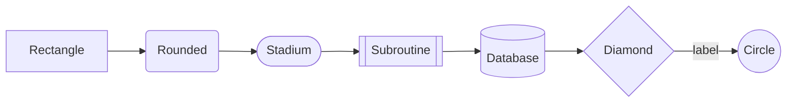
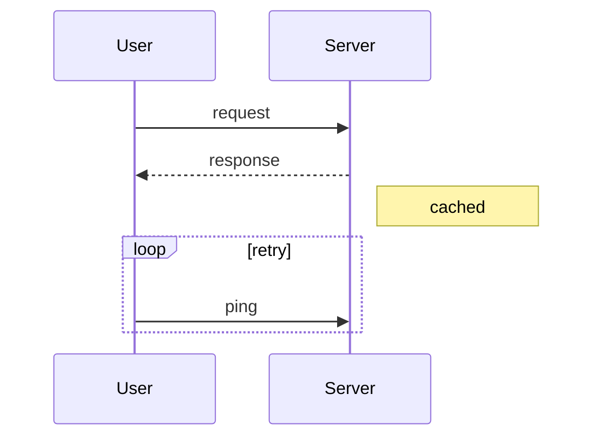
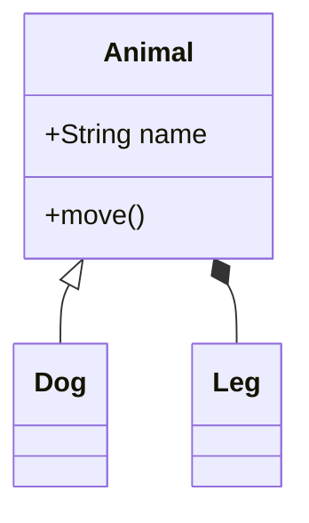
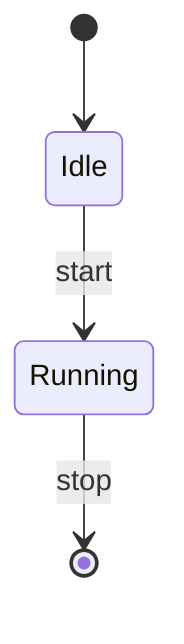
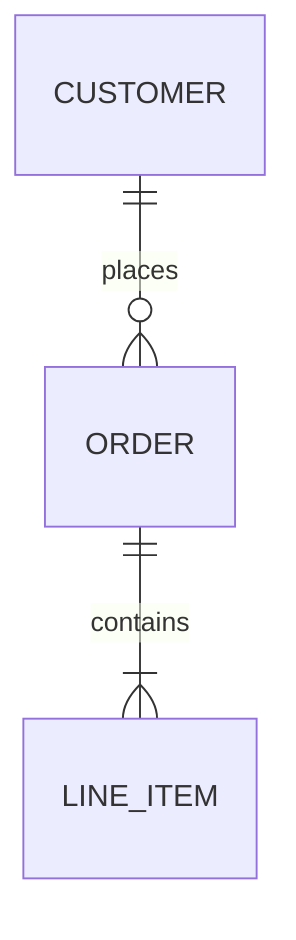

# Kino.Mermaid — Mermaid diagrams in Elixir Livebook

Kino.Mermaid renders [Mermaid](https://mermaid.js.org/) diagram source (a text DSL) as SVG inside Livebook cells. You pass a Mermaid definition string to `Kino.Mermaid.new/1` and Livebook draws the flowchart, sequence diagram, ER diagram, etc. It is a thin bridge: all the syntax is standard Mermaid, so anything the current Mermaid major supports works here. Runs only inside Livebook/Kino.

**Current Version**: `Kino.Mermaid` ships with core `kino` (~> 0.11+); renders Mermaid v10/v11 (current major) in-browser  **License**: Apache-2.0 (Kino), MIT (Mermaid)  **Runtime**: Livebook / Kino

> Accuracy note: In recent Kino, `Kino.Mermaid` is part of the core `kino` package (no separate dependency). Older notebooks used a standalone `kino_mermaid` or a raw markdown/JS approach. If `Kino.Mermaid` is undefined, upgrade `kino`, or fall back to the Kino.JS embed shown below.

## Official Resources & Documentation
- Kino.Mermaid docs: https://hexdocs.pm/kino/Kino.Mermaid.html
- Mermaid syntax docs: https://mermaid.js.org/intro/
- Mermaid live editor (prototype syntax): https://mermaid.live/
- Kino repo: https://github.com/livebook-dev/kino
- Livebook: https://livebook.dev/

## Installation & Setup
### Mix / Livebook setup cell
```elixir
Mix.install([{:kino, "~> 0.12"}])
```
No separate Mermaid dependency — it is bundled with Kino.

## Core Syntax / API Reference

### The single entry point
```elixir
Kino.Mermaid.new(diagram_source_string)
```
`diagram_source_string` is a Mermaid definition. The **first token** selects the diagram type (`flowchart`, `sequenceDiagram`, `classDiagram`, `stateDiagram-v2`, `erDiagram`, `gantt`, `pie`, `journey`, `mindmap`, `gitGraph`, `timeline`, `quadrantChart`, `C4Context`, etc.). Use a heredoc so the multi-line source stays readable:
```elixir
Kino.Mermaid.new("""
flowchart TD
    A[Start] --> B{Decision}
    B -->|Yes| C[Process]
    B -->|No| D[Alternative]
    C --> E[End]
    D --> E
""")
```

### Flowchart grammar

- **Direction**: `TD`/`TB` (top-down), `BT`, `LR`, `RL`.
- **Node shapes**: `[]` rect, `()` rounded, `([])` stadium, `[[]]` subroutine, `[()]`/`[( )]` cylinder/DB, `{}` diamond, `{{}}` hexagon, `(())` circle, `>]` flag.
- **Edges**: `-->` arrow, `---` open, `-.->` dotted, `==>` thick, `-->|text|` labeled, `--x` cross, `--o` circle end.

### Sequence diagram

Arrows: `->>` solid, `-->>` dashed reply, `-x` async. Blocks: `loop`, `alt`/`else`, `opt`, `par`, `Note`.

### Class diagram

Relations: `<|--` inheritance, `*--` composition, `o--` aggregation, `-->` association, `..>` dependency.

### State, ER, and more



## Diagram Types you can render
`flowchart` (graph), `sequenceDiagram`, `classDiagram`, `stateDiagram-v2`, `erDiagram`, `gantt`, `pie`, `journey` (user journey), `mindmap`, `timeline`, `gitGraph`, `quadrantChart`, `requirementDiagram`, `C4Context`/`C4Container` (C4 model), `sankey-beta`, and `xychart-beta`. Availability tracks the Mermaid version Livebook bundles; the newest `*-beta` types may lag.

## How-To (worked recipes)

### How to add colors / styling / a theme to a Mermaid diagram
Three levers: per-node `style`, reusable `classDef` + `class`, and a front-matter/`%%{init}%%` theme directive.
```elixir
Kino.Mermaid.new("""
%%{init: {'theme': 'dark', 'themeVariables': {'primaryColor': '#1e3a8a'}}}%%
flowchart TD
    A[Ingest] --> B[Transform]
    B --> C[Load]

    classDef good fill:#16a34a,stroke:#065f46,color:#fff;
    classDef warn fill:#f59e0b,stroke:#92400e,color:#111;
    class A,C good
    class B warn

    style B stroke-width:3px,stroke-dasharray:5 5
""")
```
- **Built-in themes** (via `init`): `default`, `neutral`, `dark`, `forest`, `base`. With `base` you override `themeVariables`.
- **`classDef name fill:…,stroke:…,color:…`** then `class NodeA,NodeB name` — the idiomatic reusable way to color many nodes.
- **`style NodeId prop:val,…`** — one-off per-node styling.
- **Edge labels/link styling**: `linkStyle 0 stroke:#f00,stroke-width:2px;` targets the Nth edge.

### How to draw a decision flowchart
```elixir
Kino.Mermaid.new("""
flowchart TD
    Start([Receive request]) --> Auth{Authenticated?}
    Auth -->|no| Reject[401]
    Auth -->|yes| Rate{Under limit?}
    Rate -->|no| Throttle[429]
    Rate -->|yes| Handle[Process] --> Done([200])
""")
```

### How to render a sequence diagram from data
Build the source with Elixir, then hand it to Kino:
```elixir
steps = [{"User", "API", "POST /login"}, {"API", "DB", "SELECT user"}, {"DB", "API", "row"}, {"API", "User", "token"}]

body = Enum.map_join(steps, "\n", fn {from, to, msg} -> "    #{from}->>#{to}: #{msg}" end)
Kino.Mermaid.new("sequenceDiagram\n" <> body)
```

### How to build an ER diagram for a schema
```elixir
Kino.Mermaid.new("""
erDiagram
    USER ||--o{ POST : writes
    POST ||--o{ COMMENT : has
    USER {
      int id PK
      string email
    }
    POST {
      int id PK
      int user_id FK
    }
""")
```

### How to fall back to Kino.JS when Kino.Mermaid is unavailable
```elixir
defmodule MermaidJS do
  use Kino.JS
  def new(src), do: Kino.JS.new(__MODULE__, src)
  asset "main.js" do
    """
    export async function init(ctx, src) {
      const {default: mermaid} =
        await import("https://cdn.jsdelivr.net/npm/mermaid@11/dist/mermaid.esm.min.mjs");
      mermaid.initialize({startOnLoad: false});
      const {svg} = await mermaid.render("g" + Date.now(), src);
      ctx.root.innerHTML = svg;
    }
    """
  end
end

MermaidJS.new("flowchart LR\n A --> B --> C")
```

## Do's and Don'ts
### ✅ Do
- Keep diagram source in a heredoc (`"""`) — Mermaid is whitespace/newline sensitive.
- Start every diagram with its type keyword on the first non-blank line.
- Quote node text containing spaces/special chars: `A["My Node (v2)"]`.
- Use `classDef` + `class` to color groups of nodes consistently.
- Prototype tricky syntax in https://mermaid.live/ first, then paste the string.

### ❌ Don't
- Don't indent the diagram-type keyword or leave a stray blank first line — parsing fails.
- Don't put raw parentheses/brackets in labels unquoted — `A[Node (x)]` breaks; quote it.
- Don't expect interactive/clickable diagrams — Kino.Mermaid output is static SVG.
- Don't rely on the very newest `*-beta` diagram types without checking the bundled Mermaid version.
- Don't build source with unescaped user input that could contain Mermaid control chars.

## Styling, Theming & Customization
- **Theme directive**: `%%{init: {'theme': 'dark'}}%%` on the first line, or YAML front matter `---\nconfig:\n  theme: dark\n---`.
- **Theme variables** (with `theme: base`): `primaryColor`, `primaryTextColor`, `lineColor`, `secondaryColor`, `tertiaryColor`, `fontFamily`.
- **Per-node**: `style Id fill:#…,stroke:#…,stroke-width:2px,color:#…`.
- **Classes**: `classDef` defines, `class` applies, `:::className` inline (`A:::good`).
- **Edges**: `linkStyle N stroke:…`.
- Mermaid has no per-diagram CSS injection in this bridge; theming goes through the directive + classDef mechanism.

## Advanced Features
- **Subgraphs** in flowcharts: `subgraph title … end` to cluster nodes.
- **C4 model** diagrams (`C4Context`, `C4Container`) for architecture.
- **Gantt** charts for schedules; **journey** maps for UX; **mindmap**/**timeline** for ideation.
- **gitGraph** to illustrate branching strategies.
- Output SVG can be copied out of Livebook for docs/READMEs (GitHub renders Mermaid in fenced ```mermaid blocks natively).

## Common Pitfalls & Troubleshooting
- **Parse error / blank cell**: leading whitespace before the type keyword, or an unquoted special char in a label.
- **Arrow renders as text**: wrong arrow token for the diagram type (sequence uses `->>`, flowchart uses `-->`).
- **Theme ignored**: the `%%{init}%%` directive must be the very first line, correctly quoted JSON-in-YAML.
- **Newest diagram type unknown**: Livebook's bundled Mermaid predates it — use the Kino.JS fallback pinned to `mermaid@11`.
- **Dynamic string has literal `\n`**: build with real newlines (`"\n"` in Elixir strings) not escaped text.

## Integration Notes (Livebook/Kino)
- The same Mermaid string works in a Livebook **Markdown cell** fenced as ```mermaid — use Kino.Mermaid only when you generate the diagram from Elixir data at runtime.
- Great for documenting supervision trees, request flows, and schemas alongside live code.
- Pairs with kino-process.md (auto-generated OTP trees) when you want a hand-authored architecture view.

## Best For / Avoid For
`livebook`, `elixir`, `diagrams`, `flowchart`, `sequence`, `er`, `documentation`, `text-to-diagram`
- **Best for**: architecture/flow/sequence/ER documentation authored as text, diagrams generated from Elixir data, notebook-based technical writing.
- **Avoid for**: interactive/clickable diagrams, precise pixel layout, or large auto-laid-out graphs (Mermaid's auto-layout gets crowded — consider Graphviz/D3 for those).

## See Also
- [kino-process.md](kino-process.md) — auto-generated OTP process/supervision trees
- [kino-js.md](kino-js.md) — custom-widget mechanism used in the fallback
- [mermaid.md](mermaid.md) — the full Mermaid DSL reference (all diagram types + styling)
- `../use-case/elixir-livebook-components.md`, `../use-case/diagram-generation.md`
