# Mermaid — Text-to-Diagram Rendering for Markdown & the Web

Mermaid turns a compact, indentation-light text grammar into SVG diagrams — flowcharts, sequence diagrams, class/state/ER models, Gantt charts, and more. It renders natively inside GitHub, GitLab, Notion, Obsidian, VS Code, and most modern Markdown pipelines, and runs client-side as a JavaScript library or headless via the mermaid-cli. Because the source is plain text, diagrams are diff-friendly and belong directly in version control.

**Current Version**: mermaid@11 (current major)  **License**: MIT  **Runtime**: browser JS (~2.8MB full bundle, tree-shakeable via ESM) or Node/CLI (`@mermaid-js/mermaid-cli`)

## Official Resources & Documentation
- **Docs**: https://mermaid.js.org/
- **Live Editor**: https://mermaid.live/ (share/export SVG/PNG, config playground)
- **GitHub**: https://github.com/mermaid-js/mermaid
- **npm**: https://www.npmjs.com/package/mermaid
- **CLI**: https://github.com/mermaid-js/mermaid-cli
- **Config schema**: https://mermaid.js.org/config/schema-docs/config.html
- **Diagram syntax index**: https://mermaid.js.org/intro/syntax-reference.html

## Installation & Setup

### npm (bundler / app)
```bash
npm install mermaid
```
```javascript
import mermaid from 'mermaid';
mermaid.initialize({ startOnLoad: true, theme: 'default' });
// Programmatic render (v10+ is Promise-based):
const { svg } = await mermaid.render('graphDiv', 'graph TD; A-->B;');
document.getElementById('out').innerHTML = svg;
```

### CDN / browser (ESM)
```html
<script type="module">
  import mermaid from 'https://cdn.jsdelivr.net/npm/mermaid@11/dist/mermaid.esm.min.mjs';
  mermaid.initialize({ startOnLoad: true });
</script>
<pre class="mermaid">
  graph LR
    A[Start] --> B{Decision}
    B -->|Yes| C[Process]
    B -->|No| D[End]
    C --> D
</pre>
```

### CLI (headless SVG/PNG/PDF export)
```bash
npm install -g @mermaid-js/mermaid-cli
mmdc -i diagram.mmd -o diagram.svg          # or .png / .pdf
mmdc -i diagram.mmd -o out.png -t dark -b transparent
```

### Markdown fenced block (GitHub/GitLab/Obsidian)
Just fence the source with the `mermaid` info-string — no setup required:
````markdown

````

## Core Syntax Reference

Every diagram begins with a **diagram-type keyword** on the first non-comment line. The keyword selects the parser; the rest of the block is that grammar.

| Keyword | Diagram |
|---|---|
| `flowchart` / `graph` | Flowchart (nodes + edges) |
| `sequenceDiagram` | Sequence / interaction |
| `classDiagram` | UML class |
| `stateDiagram-v2` | State machine |
| `erDiagram` | Entity-relationship |
| `gantt` | Gantt / schedule |
| `pie` | Pie chart |
| `journey` | User journey |
| `mindmap` | Mind map |
| `timeline` | Timeline |
| `requirementDiagram` | Requirements (SysML-style) |
| `gitGraph` | Git branch/commit graph |
| `quadrantChart` | 2×2 quadrant scatter |
| `C4Context` / `C4Container` / `C4Component` | C4 model (experimental) |
| `sankey-beta` | Sankey flow |
| `xychart-beta` | XY line/bar chart |
| `block-beta` | Block diagram |

### Comments and directives

- `%% ... %%` (or line starting with `%%`) is a comment.
- A YAML **frontmatter** block (`---`) sets per-diagram config and title (preferred over the older `%%{init}%%` directive).

### Frontmatter config (preferred, v10.5+)
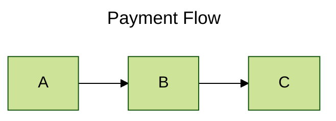

### Legacy init directive (still valid)
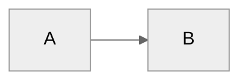

## Diagram Types — Idiomatic Examples

### Flowchart
Direction tokens: `TD`/`TB` (top-down), `BT`, `LR`, `RL`.
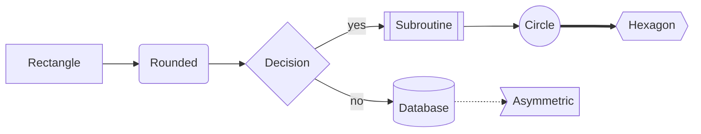
Node shapes: `[ ]` rect, `( )` round, `([ ])` stadium, `[[ ]]` subroutine, `[( )]` cylinder/DB, `(( ))` circle, `> ]` asymmetric, `{ }` rhombus/decision, `{{ }}` hexagon, `[/ /]` parallelogram, `[\ \]` reverse parallelogram, `[/ \]` trapezoid.
Edge kinds: `-->` arrow, `---` open, `-.->` dotted, `==>` thick, `--text-->` labeled, `--o` circle-end, `--x` cross-end, `<-->` bidirectional. Chaining: `A --> B --> C`; fan-out: `A --> B & C`.

### Sequence diagram
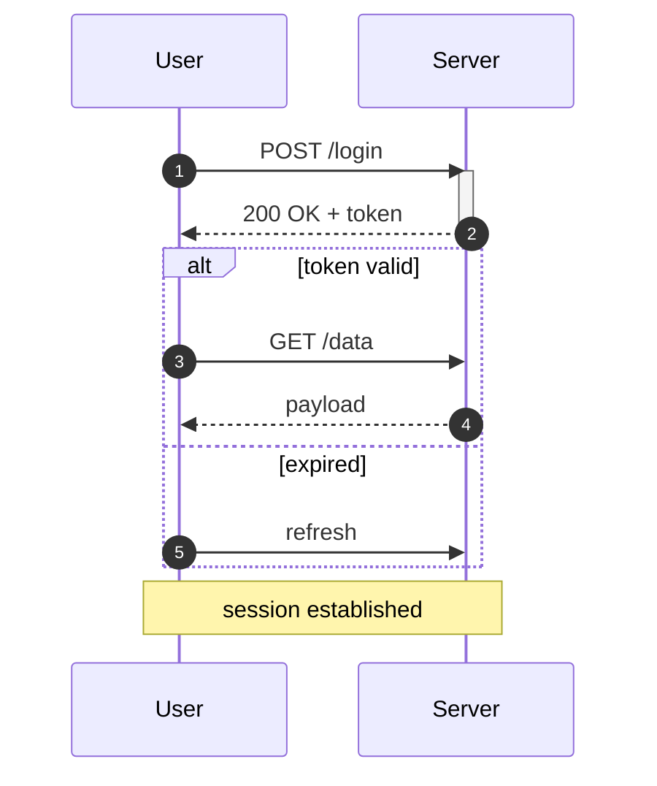
Arrows: `->>` solid+arrow, `-->>` dashed+arrow (reply), `->` solid no-arrow, `-x` lost, `-)` async. Blocks: `alt/else/end`, `opt`, `loop`, `par/and`, `critical`, `break`, `rect` (background), `Note left of/right of/over`.

### Class diagram
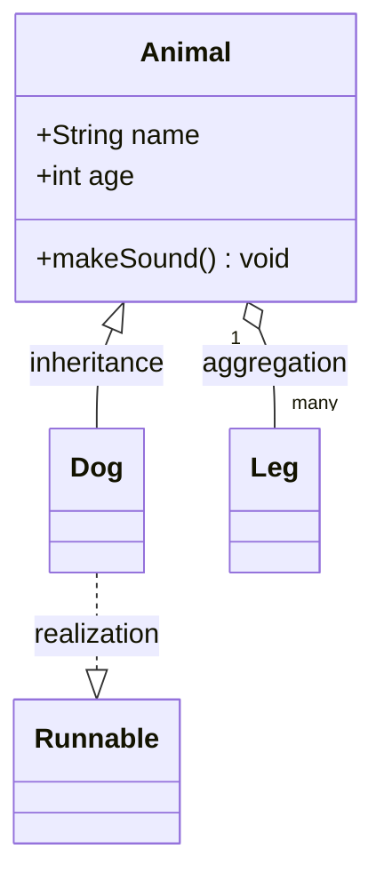
Relations: `<|--` inheritance, `*--` composition, `o--` aggregation, `-->` association, `..>` dependency, `..|>` realization, `--` link. Visibility: `+` public, `-` private, `#` protected, `~` package.

### State diagram
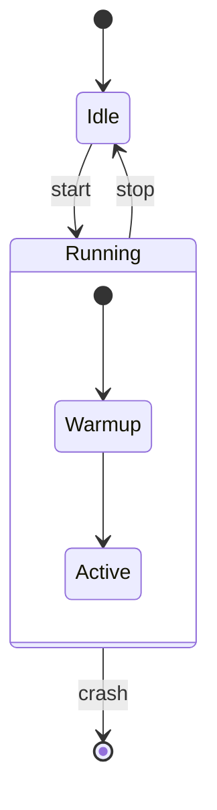
`[*]` is start/end; composite states nest with `state Name { ... }`; forks/joins via `state fork <<fork>>`; choice via `<<choice>>`.

### Entity-Relationship
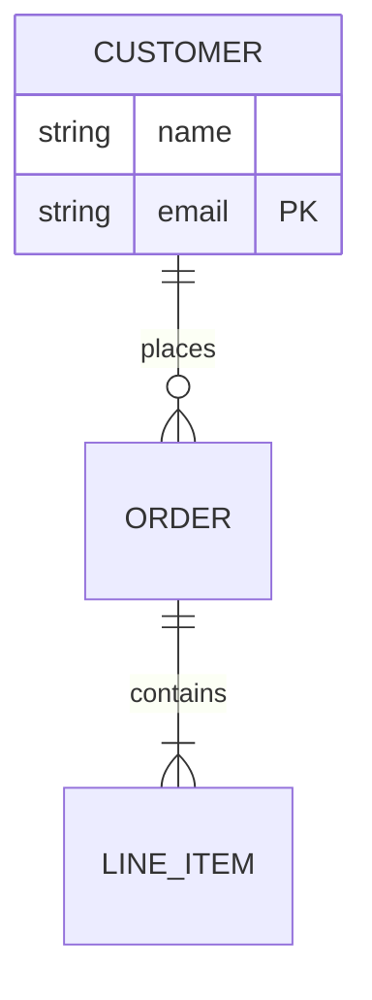
Cardinality glyphs: `|o` zero-or-one, `||` exactly-one, `}o` zero-or-many, `}|` one-or-many; solid `--` identifying, dashed `..` non-identifying.

### Gantt
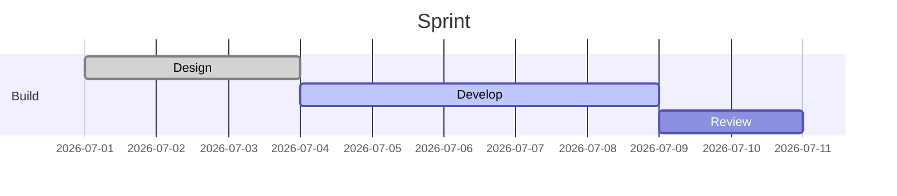

### Pie, Journey, Mindmap, Timeline, Requirement, GitGraph, Quadrant
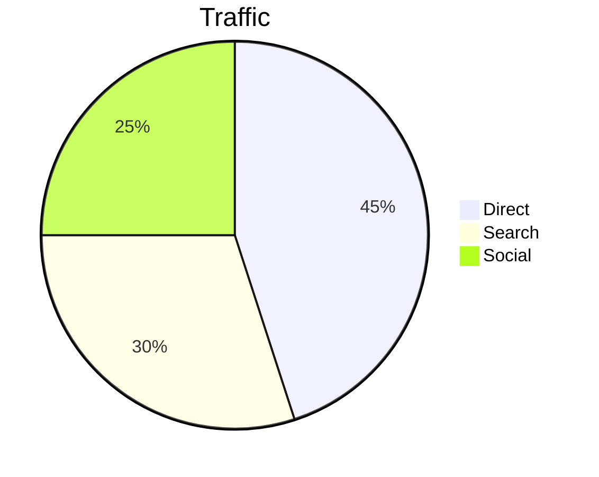
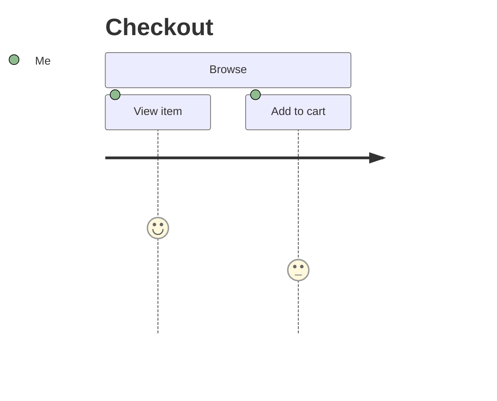
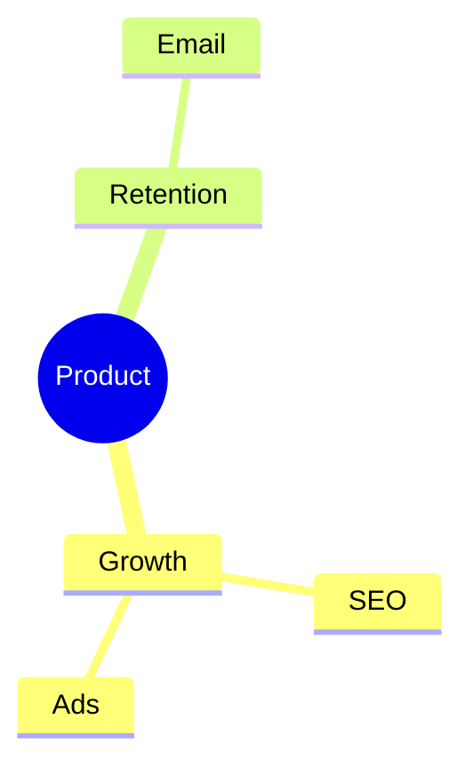
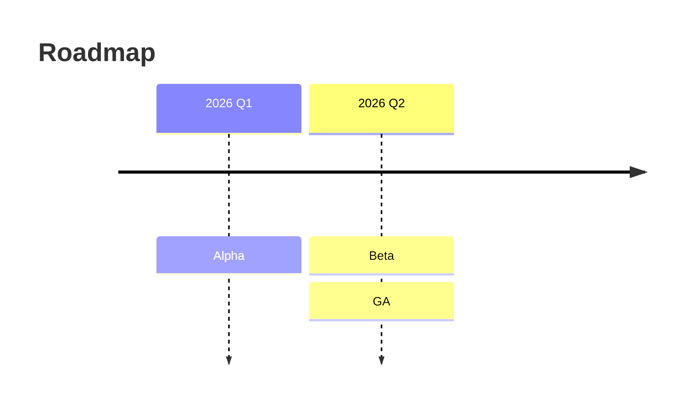
```mermaid
requirementDiagram
  requirement auth_req {
    id: 1
    text: users must authenticate
    risk: high
    verifymethod: test
  }
  element login { type: feature }
  login - satisfies -> auth_req
```
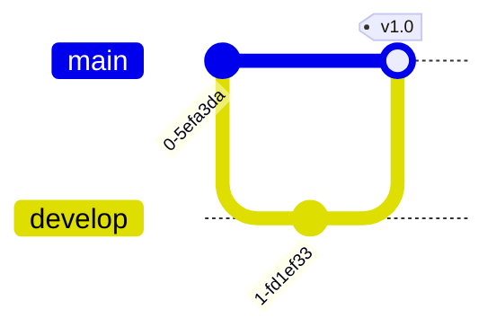
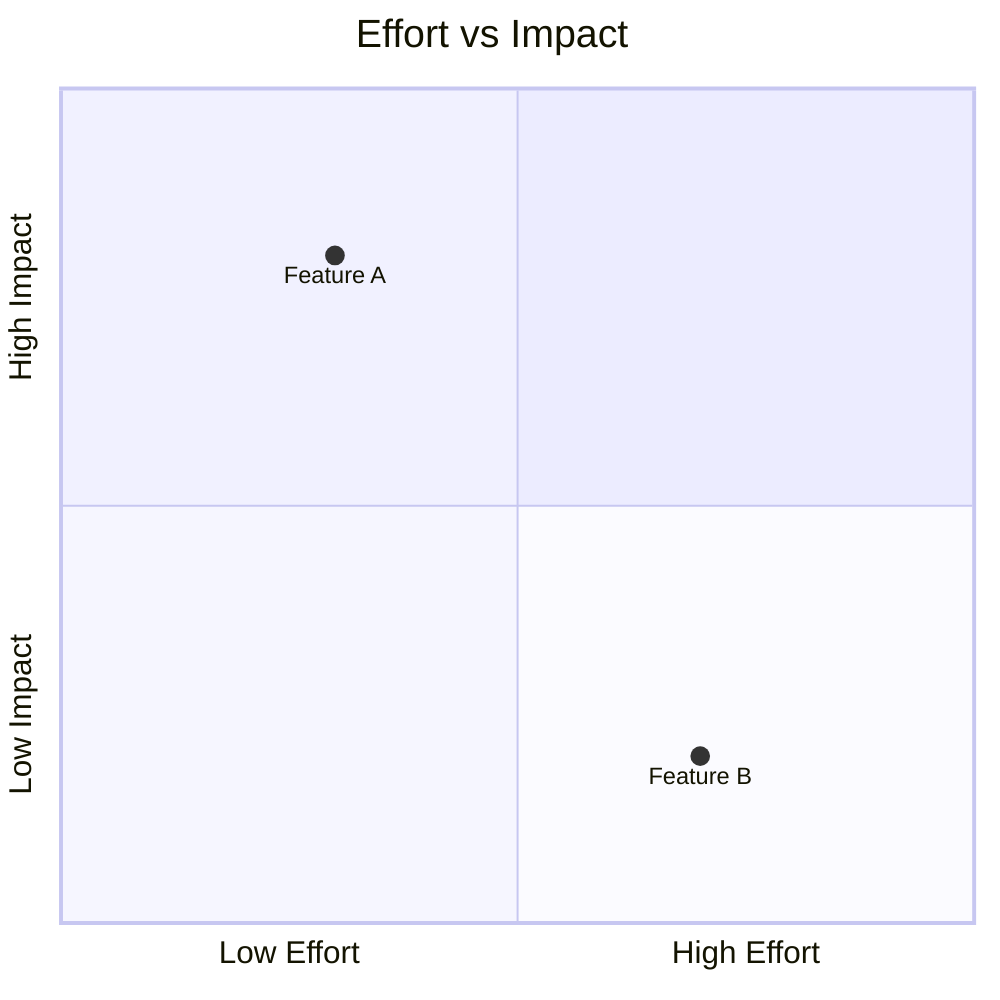

## How-To

### How to add colors / styling / themes to a Mermaid diagram
Three complementary mechanisms — pick by scope:

**1. Per-node inline `style`** (one element):
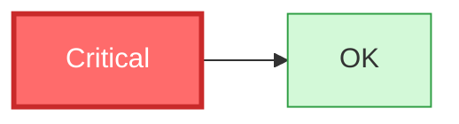

**2. Reusable `classDef` + `class`** (apply one style to many nodes — the idiomatic approach):
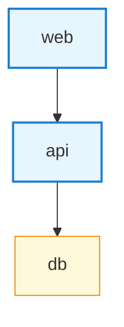
Shorthand: append `:::className` to a node — `A[web]:::service`. The reserved class `default` restyles all unclassed nodes.

**3. Theme + `themeVariables`** (whole-diagram palette). Built-in themes: `default`, `neutral`, `dark`, `forest`, `base`. Only `base` is meant to be customized:
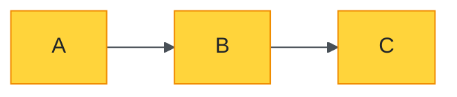
Note: link/edge styling uses `linkStyle <index> stroke:#f00,stroke-width:2px;` where the index is the edge's declaration order (or `linkStyle default ...`).

### How to set flowchart direction and subgraphs
```mermaid
flowchart TB
  subgraph frontend [Frontend]
    direction LR
    U[UI] --> R[Router]
  end
  subgraph backend [Backend]
    A[API] --> D[(DB)]
  end
  R --> A
```
`subgraph id [Display Label] ... end` groups nodes; an inner `direction` overrides layout inside the group.

### How to attach click interactions
```mermaid
flowchart LR
  A[Docs] --> B[Repo]
  click A "https://mermaid.js.org" "Open docs" _blank
  click B callbackFn "Tooltip text"
```
`click node "URL" "tooltip" _blank` opens a link; `click node functionName` calls a registered JS callback. Requires `securityLevel: 'loose'` in config for callbacks (see pitfalls).

### How to export a diagram to SVG/PNG headlessly
```bash
mmdc -i flow.mmd -o flow.svg -t neutral -b white
mmdc -i flow.mmd -o flow.png -w 1600 -H 900 -s 2   # width/height/scale
```

### How to render many diagrams on a dynamic page
```javascript
mermaid.initialize({ startOnLoad: false });
// after injecting <pre class="mermaid"> nodes:
await mermaid.run({ querySelector: '.mermaid' });
```

## Do's and Don'ts

### ✅ Do
- Put the diagram-type keyword on the **first** line (after any `---` frontmatter). `flowchart TD` / `sequenceDiagram` etc.
- Prefer `flowchart` over the older `graph` alias — same engine, clearer intent.
- Use `classDef` + `class` for repeated styling instead of many `style` lines.
- Quote labels containing special chars: `A["text with (parens) & <html>"]`.
- Use `<br/>` for line breaks inside labels: `A["line1<br/>line2"]`.
- Use frontmatter `config:` for per-diagram theming — it travels with the source and works in the Live Editor.
- Give nodes stable IDs (`api`, `db`) separate from display labels (`api[Payments API]`).

### ❌ Don't
- Don't indent or blank-line before the type keyword — some renderers fail to detect the diagram.
- Don't reuse a node ID for two different shapes; the first declaration's shape wins.
- Don't rely on `theme` other than `base` for `themeVariables` overrides — the non-base themes ignore many variables.
- Don't put raw parentheses/quotes/semicolons in unquoted labels — they break the parser; wrap in `"..."`.
- Don't expect precise manual layout — Mermaid auto-lays-out via dagre; you influence, not dictate, position.
- Don't use `click` callbacks with the default `securityLevel: 'strict'` — they're disabled for safety.

## Styling, Theming & Customization
- **Themes**: `default`, `neutral`, `dark`, `forest`, `base`. Set globally in `initialize({theme})` or per-diagram in frontmatter.
- **themeVariables** (with `theme: base`): `primaryColor`, `primaryTextColor`, `primaryBorderColor`, `secondaryColor`, `tertiaryColor`, `lineColor`, `background`, `mainBkg`, `nodeBorder`, `clusterBkg`, `titleColor`, `fontFamily`, `fontSize`, plus per-diagram groups (e.g. `actorBkg`, `noteBkgColor` for sequence; `git0`..`git7` for gitGraph).
- **classDef** properties are SVG/CSS: `fill`, `stroke`, `stroke-width`, `stroke-dasharray`, `color` (text), `font-size`, `font-weight`. Semicolon-terminate.
- **CSS override**: when embedded, target generated classes (`.node rect`, `.edgePath path`) with external CSS; pass custom CSS to the CLI via `--cssFile`.
- **linkStyle / edge color**: `linkStyle 0 stroke:#e64980,color:#e64980;` styles the first edge; index is zero-based in declaration order.

## Advanced Features
- **Config frontmatter** exposes the full config schema per diagram: `flowchart.curve` (`basis`/`linear`/`stepBefore`…), `flowchart.htmlLabels`, `sequence.mirrorActors`, `gantt.barHeight`, `look: 'handDrawn'` (v11 sketchy look), `layout: 'elk'` (ELK layout engine for large flowcharts).
- **ELK layout** (`config.layout: elk`) gives cleaner routing for dense graphs; requires the `@mermaid-js/layout-elk` package in bundler setups.
- **Icons / FontAwesome** in flowchart labels: `A[fa:fa-user User]` (renderer must load FA).
- **Accessibility**: `accTitle:` and `accDescr:` lines emit `<title>`/`<desc>` on the SVG.
- **Integration**: `mermaid.registerIconPacks()` for iconify; `mermaid.parse(text)` validates without rendering (returns/throws).

## Common Pitfalls & Troubleshooting
- **Blank output / "Syntax error in text"**: type keyword missing, mistyped, or preceded by whitespace. Validate with `mermaid.parse()` or the Live Editor.
- **Callbacks/HTML not working**: `securityLevel` defaults to `'strict'` (sanitizes HTML, disables `click` callbacks). Set `securityLevel: 'loose'` only for trusted input — it re-enables inline HTML and JS callbacks.
- **`themeVariables` ignored**: you must set `theme: base` — other themes hard-code most colors.
- **Labels with `(`, `)`, `:`, `;`, `#`**: quote the label (`["..."]`) or escape via `#35;` HTML entities.
- **GitHub vs library drift**: GitHub pins an older mermaid; newer syntax (`block-beta`, `timeline`, ELK) may not render there. Check the target renderer's version.
- **Large flowchart is unreadable**: switch to `config.layout: elk`, break into `subgraph`s, or set `flowchart.curve: linear`.
- **Non-deterministic node IDs across renders**: pass a stable id to `mermaid.render(id, text)`.

## Integration Notes
- **Markdown hosts**: GitHub, GitLab, Gitea, Obsidian, Notion, Docusaurus (`@docusaurus/theme-mermaid`), MkDocs (`mkdocs-mermaid2`), Hugo shortcodes — most just need the fenced ```mermaid block.
- **Elixir/Livebook**: use `Kino.Mermaid.new(source)` — see `kino-mermaid.md`.
- **SSR/bundlers**: mermaid needs a DOM; server-side render via `mermaid-cli`/Puppeteer or `@mermaid-js/mermaid` with jsdom. Lazy-import the ESM build to keep it out of the initial bundle.

## Best For / Avoid For
Best for: `documentation-diagrams`, `flowcharts`, `sequence-diagrams`, `state-machines`, `er-diagrams`, `gantt`, `git-workflows`, `markdown-native`, `version-controlled-diagrams`.
Avoid for: pixel-precise layouts, print-grade engineering schematics, very large (>150 node) graphs without ELK, or interactive dashboards — reach for `graphviz` (fine layout control), `plantuml` (richer UML + skinparam), `d3`/`cytoscape` (interactive), or `drawio` (manual placement) instead.

## See Also
- `plantuml.md` — richer UML surface, skinparam theming, server rendering
- `graphviz.md` / `graphviz-dot.md` — fine-grained layout control via DOT
- `c4-plantuml.md` / `structurizr-dsl.md` — architecture/C4 modeling
- `nomnoml.md`, `yuml.md` — lightweight text UML alternatives
- `kino-mermaid.md` — Mermaid inside Elixir Livebook
- `../use-case/diagram-generation.md` — choosing a diagram tool for a task
- `../use-case/networks-graphs.md` — graph/network-oriented rendering
