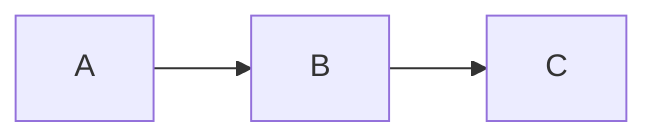

# MkDocs — Markdown-only documentation site generator (Python)

MkDocs is a fast, Python-based static site generator purpose-built for project documentation. You write Markdown, describe navigation in one `mkdocs.yml`, and get a themed site with client-side search. Paired with the **Material for MkDocs** theme it produces polished, feature-rich docs (admonitions, tabs, code annotations) with minimal effort.

**Current Version**: MkDocs 1.6.x · Material for MkDocs 9.x (current majors)  **License**: BSD (MkDocs), MIT (Material)  **Runtime**: Python 3.8+ (`mkdocs`); Markdown via Python-Markdown

## Official Resources & Documentation
- **MkDocs**: https://www.mkdocs.org/
- **User guide / config**: https://www.mkdocs.org/user-guide/configuration/
- **Material for MkDocs**: https://squidfunk.github.io/mkdocs-material/
- **Material reference (admonitions, etc.)**: https://squidfunk.github.io/mkdocs-material/reference/
- **Plugins catalog**: https://github.com/mkdocs/catalog
- **GitHub**: https://github.com/mkdocs/mkdocs

## Installation & Setup
```bash
pip install mkdocs mkdocs-material
mkdocs new my-project
cd my-project
mkdocs serve                # dev server at http://127.0.0.1:8000 (live reload)
mkdocs build                # static output -> site/
mkdocs gh-deploy            # build + push to gh-pages branch
```

## Project Structure
```
my-project/
├── mkdocs.yml          # the single config file
└── docs/
    ├── index.md        # home page
    ├── guide/
    │   ├── install.md
    │   └── config.md
    ├── api.md
    └── assets/
        ├── extra.css
        └── logo.png
```

## Configuration (mkdocs.yml)
```yaml
site_name: My Documentation
site_url: https://example.com/
repo_url: https://github.com/me/project
edit_uri: edit/main/docs/

theme:
  name: material
  palette:
    - scheme: default
      primary: indigo
      accent: blue
      toggle: {icon: material/weather-night, name: Switch to dark mode}
    - scheme: slate
      primary: indigo
      toggle: {icon: material/weather-sunny, name: Switch to light mode}
  features:
    - navigation.tabs
    - navigation.sections
    - navigation.instant
    - content.code.copy
    - content.code.annotate
    - toc.integrate

nav:
  - Home: index.md
  - User Guide:
      - Installation: guide/install.md
      - Configuration: guide/config.md
  - API Reference: api.md

markdown_extensions:
  - admonition
  - pymdownx.details
  - pymdownx.superfences
  - pymdownx.tabbed: {alternate_style: true}
  - pymdownx.highlight: {anchor_linenums: true}
  - toc: {permalink: true}
  - tables
  - footnotes

plugins:
  - search
  - tags

extra_css:
  - assets/extra.css
```
`nav` defines the sidebar/tabs; omit it and MkDocs auto-builds nav from the file tree. `markdown_extensions` (mostly **PyMdown Extensions**) unlock admonitions, tabs, code features.

## Core Markdown Features (with Material)

### Admonitions
```markdown
!!! note "Optional title"
    Indented body (4 spaces) becomes the callout content.

??? tip "Collapsible"
    Uses pymdownx.details for a foldable admonition.
```
Types: `note`, `abstract`, `info`, `tip`, `success`, `question`, `warning`, `failure`, `danger`, `bug`, `example`, `quote`.

### Content tabs
```markdown
=== "Python"
    ```python
    print("hi")
    ```
=== "JavaScript"
    ```js
    console.log("hi");
    ```
```
Requires `pymdownx.tabbed`.

### Code blocks with annotations & highlighting
````markdown
```python title="app.py" linenums="1" hl_lines="2"
def main():
    print("highlighted")  # (1)!
```

1.  This numbered annotation is attached to the code line above.
````
Needs `pymdownx.highlight` + `pymdownx.superfences` and the `content.code.annotate` feature.

### Buttons, keys, icons (Material)
```markdown
[Get started](guide/install.md){ .md-button .md-button--primary }
++ctrl+alt+del++
:material-check:  :fontawesome-brands-github:
```

## How-To (worked recipes)

### How to theme & add colors
Material exposes a **color palette** in `mkdocs.yml`; deeper customization uses `extra_css` (or CSS custom properties). This is the "add colors/styling" path:
```yaml
theme:
  name: material
  palette:
    primary: teal      # named Material color
    accent: deep-orange
extra_css:
  - assets/extra.css
```
```css
/* docs/assets/extra.css — override Material's CSS variables */
:root {
  --md-primary-fg-color:        #1e6fba;
  --md-primary-fg-color--dark:  #17568f;
  --md-accent-fg-color:         #e8590c;
}
.md-typeset .admonition.note { border-left-color: #1e6fba; }
```
Named palettes cover common cases; `--md-*` custom properties in `extra_css` give exact brand colors and dark-mode variants.

### How to enable dark/light toggle
```yaml
theme:
  palette:
    - scheme: default
      toggle: {icon: material/brightness-7, name: Dark mode}
    - scheme: slate
      toggle: {icon: material/brightness-4, name: Light mode}
```
Two palette entries with `toggle` blocks give users a switch (Material feature).

### How to add a diagram plugin
```yaml
markdown_extensions:
  - pymdownx.superfences:
      custom_fences:
        - name: mermaid
          class: mermaid
          format: !!python/name:pymdownx.superfences.fence_code_format
```
````markdown

````
Material renders Mermaid diagrams natively via this superfences config.

### How to deploy to GitHub Pages
```bash
mkdocs gh-deploy --force
```
One command builds and pushes to the `gh-pages` branch. For CI, run it in a GitHub Actions workflow on push to `main`.

## Do's and Don'ts

### ✅ Do
- Use **Material for MkDocs** unless you have a reason not to — it's the de-facto standard with the richest features.
- Declare **`nav`** explicitly for control over order and grouping.
- Enable the **PyMdown Extensions** you need (`superfences`, `tabbed`, `highlight`, `details`) — many features depend on them.
- Put custom styles in **`extra_css`** and override Material's `--md-*` variables rather than forking the theme.
- Set **`site_url`** so search, sitemap, and canonical links work.

### ❌ Don't
- Don't expect **RST or other formats** — MkDocs is Markdown-only (unlike Sphinx; see sphinx.md).
- Don't rely on admonitions/tabs without enabling the **matching extension** — they render as literal text otherwise.
- Don't hand-maintain nav if the file tree already matches — omit `nav` to auto-generate.
- Don't put content outside **`docs/`** and expect it in the build.
- Don't forget 4-space indentation inside admonitions — mis-indented content leaks out.

## Styling, Theming & Customization
- **Palette**: `theme.palette` (primary/accent, light+dark schemes with toggles).
- **Features**: `theme.features` toggle navigation tabs/sections/instant loading, code copy/annotate, TOC integration, search suggestions.
- **`extra_css` / `extra_javascript`**: inject assets; override `--md-*` CSS variables.
- **Overrides**: `theme.custom_dir` with partial template overrides (Jinja2) for deep changes.
- **Logo/favicon**: `theme.logo`, `theme.favicon`; **fonts**: `theme.font`.

## Advanced Features
- **`mkdocstrings`** — autodoc for Python/other languages (Sphinx-autodoc analog for MkDocs).
- **`mkdocs-material` social/blog plugins** — cards, blog posts, tags, RSS.
- **`mkdocs-macros-plugin`** — Jinja2 variables/macros in Markdown.
- **`mike`** — versioned documentation deployments.
- **`awesome-pages`** — per-directory nav control without a giant `nav` block.
- **Instant navigation & search** — Material ships a fast client-side search index.

## Common Pitfalls & Troubleshooting
- **Admonition renders as plain text** → `admonition` (+ `pymdownx.details` for collapsible) extension not enabled.
- **Tabs/code annotations not working** → missing `pymdownx.tabbed`/`superfences`/`highlight` or the `content.code.*` feature.
- **Page missing from nav** → not listed in `nav` and outside `docs/`.
- **CSS not applied** → file not under `docs/` or not listed in `extra_css`; hard-refresh.
- **`mkdocs gh-deploy` overwrites site** → it force-pushes `gh-pages`; use CI to control it.
- **Mermaid not rendering** → superfences `custom_fences` block missing.

## Integration Notes
- **Read the Docs** supports MkDocs projects (alongside Sphinx).
- **Content**: Python-Markdown + PyMdown Extensions (see markdown.md).
- **CI**: `pip install mkdocs-material && mkdocs build` — simple, deterministic.
- **API docs**: `mkdocstrings` covers the autodoc gap vs Sphinx.

## Best For / Avoid For
`project-docs`, `api-docs`, `knowledge-bases`, `user-guides`, `tutorials` — choose MkDocs (Material) for fast, beautiful, Markdown-only documentation with minimal config.
Avoid for: multi-format output (PDF/EPUB — use sphinx.md, quarto.md), RST source, deep autodoc across many languages (sphinx.md), or general marketing/blog sites (hugo.md, jekyll.md).

## See Also
- `sphinx.md` — richer, multi-format, RST-based alternative
- `hugo.md`, `jekyll.md` — general-purpose static site generators
- `markdown.md` — MkDocs' content format
- `quarto.md` — docs with executable code
- `../use-case/document-processing.md`
