# PlantUML — Text-to-UML (and beyond) Diagram Generator

PlantUML is a text-based diagramming language that renders UML and many non-UML diagram families to SVG/PNG. Source is written between `@start.../@end...` fences; a Java engine (or the public/self-hosted server) lays out and renders it. It is the flagship general-purpose diagram-as-code format: one grammar covers sequence, class, activity, state, component, deployment, ER, JSON/YAML, Gantt, mindmap, WBS, salt GUI wireframes, ArchiMate, and more.

**Current Version**: PlantUML 1.2024.x+ (rolling `1.YYYY.N` scheme)  **License**: GPL / LGPL / others per distribution (engine); output is yours  **Runtime**: Java 8+ (`plantuml.jar`) or a PlantUML server; no browser runtime required

## Official Resources & Documentation
- **Primary docs**: https://plantuml.com
- **Language reference (PDF)**: https://plantuml.com/guide
- **Online server / editor**: https://www.plantuml.com/plantuml/uml/
- **Standard library (stdlib)**: https://github.com/plantuml/plantuml-stdlib
- **Themes gallery**: https://the-lum.github.io/puml-themes-gallery/
- **Real-world examples**: https://real-world-plantuml.com
- **Source**: https://github.com/plantuml/plantuml

## Installation & Setup

### Local JAR (canonical)
```bash
# Requires Java + Graphviz (dot) for class/component/state layout
java -jar plantuml.jar diagram.puml            # -> diagram.png
java -jar plantuml.jar -tsvg diagram.puml      # -> diagram.svg
java -jar plantuml.jar -tsvg -o out/ *.puml    # batch to out/
```

### Package managers
```bash
brew install plantuml            # macOS (pulls Java + Graphviz)
npm install node-plantuml        # Node wrapper
pip install plantuml             # Python client for a PlantUML server
```

### Editors / CI
```bash
# VS Code extension (preview + export)
code --install-extension jebbs.plantuml
# Server (Docker) for renderless environments
docker run -d -p 8080:8080 plantuml/plantuml-server:jetty
```

Layout note: sequence, mindmap, WBS, gantt, salt, json and yaml use PlantUML's own layout engine. Class, object, component, deployment, state, use-case and ER diagrams route edges through **Graphviz `dot`** — install it or those diagrams fail with "Cannot find Graphviz".

## Core Syntax / API Reference

### Diagram fences
Every diagram is wrapped in a start/end pair. The pair selects the diagram grammar:

| Fence | Diagram family |
|-------|----------------|
| `@startuml … @enduml` | sequence, class, object, usecase, activity, component, deployment, state, timing, ER, network |
| `@startmindmap … @endmindmap` | mind maps |
| `@startwbs … @endwbs` | work-breakdown structure |
| `@startgantt … @endgantt` | Gantt / project schedules |
| `@startsalt … @endsalt` | GUI / wireframe mockups (also usable inside `@startuml` via `salt`) |
| `@startjson … @endjson` | JSON data trees |
| `@startyaml … @endyaml` | YAML data trees |

A single `.puml` file may hold multiple `@start/@end` blocks; each renders to its own image (add `@startuml name` to name the page).

### Common directives (any UML diagram)
```plantuml
@startuml
title My Diagram
header Confidential
footer Page %page% of %lastpage%
caption Figure 1: authentication flow
scale 1.5                 ' or: scale 800 width / scale max 1024*768
skinparam backgroundColor #FEFEFE
!theme plain
legend right
  This box explains the legend
end legend
@enduml
```

### Sequence diagrams
Participants and arrow grammar:
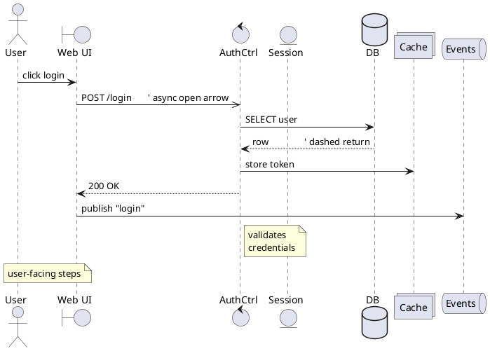

Arrow vocabulary: `->` solid, `-->` dashed (return), `->>` thin/async head, `-\` and `->x` (lost message), `<->` bidirectional. Activation: `activate`/`deactivate`/`destroy`, or the shorthand `++`/`--` appended to a message. Grouping fragments:
```plantuml
@startuml
Alice -> Bob : request
alt success
  Bob --> Alice : 200
else failure
  Bob --> Alice : 500
end
opt optional
  Alice -> Bob : ping
end
loop 3 times
  Alice -> Bob : retry
end
par
  Alice -> Carol : task A
and
  Alice -> Dave : task B
end
break on error
  Alice -> Alice : abort
end
critical section
  Bob -> DB : commit
end
group My Label
  Alice -> Bob : grouped
end
ref over Alice, Bob : see "Login" diagram
@enduml
```

### Class diagrams
```plantuml
@startuml
abstract class AbstractList
interface Comparable
enum Color { RED
GREEN
BLUE }

class Order {
  +id : UUID
  -total : Money
  #notes : String
  +submit() : void
  {static} create() : Order
  {abstract} validate() : bool
}

Order "1" *-- "many" LineItem : contains    ' composition
Order o-- Customer                          ' aggregation
Order --|> AbstractList                      ' inheritance (solid triangle)
Order ..|> Comparable                        ' realization (dashed triangle)
Order ..> Logger : uses                      ' dependency (dashed)
Order --> Payment : "1" "0..*"               ' association + cardinalities
@enduml
```
Relationship heads: `<|--`/`--|>` inheritance, `<|..`/`..|>` realization, `*--` composition, `o--` aggregation, `-->` directed association, `..>` dependency. Cardinalities go in quotes at each end.

### Object diagrams
```plantuml
@startuml
object "order:Order" as o {
  id = 42
  total = 19.99
}
object "cust:Customer" as c { name = "Ada" }
o --> c : placed_by
@enduml
```

### Use-case diagrams
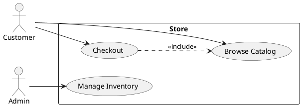

### Activity diagrams (current "beta" syntax)
Prefer the newer `start/stop` grammar over the legacy `(*)` syntax:
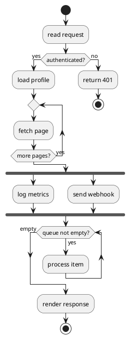
Node forms: `:action;` action, `if/elseif/else/endif`, `repeat/repeat while`, `while/endwhile`, `fork/fork again/end fork`, `split/split again/end split`, `switch/case/endswitch`, `partition Name { ... }` for swimlane-like grouping, `|Swimlane|` for true lanes.

### Component & deployment diagrams
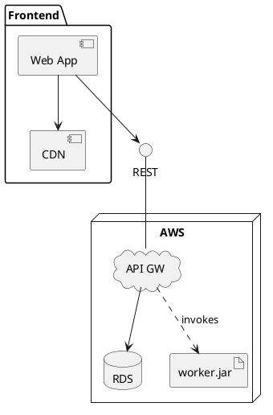

### State diagrams
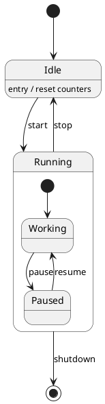

### Timing diagrams
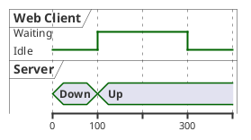

### Entity-Relationship (data model)
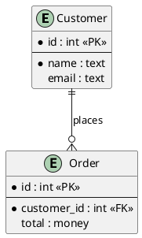
Crow's-foot cardinality: `||` one-and-only-one, `o|` zero-or-one, `}o` zero-or-many, `}|` one-or-many.

### JSON & YAML data trees
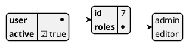
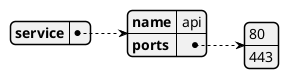

### Network (nwdiag-in-PlantUML)
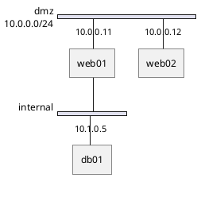

### Gantt
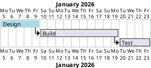

### Mindmap & WBS
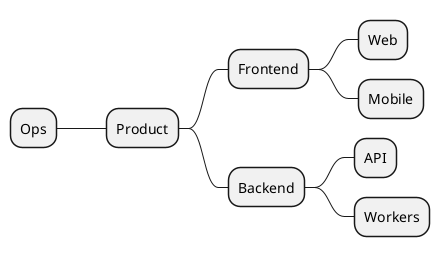
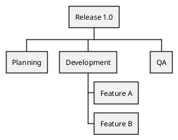
`*` = depth level; `+`/`-` after the stars force right/left side (mindmap). Use `_` (e.g. `**_`) for a boxless node.

### Salt (GUI / wireframe mockups)
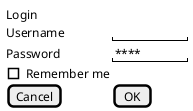
Salt widgets: `[Button]`, `"field"`, `[ ]`/`[X]` checkbox, `()`/`(X)` radio, `^Dropdown^`, `{T ...}` tree, `{+ ...}` bordered group, `{/ Tab1 | Tab2 }` tabs, `.` empty cell, `|` column separator.

### ArchiMate
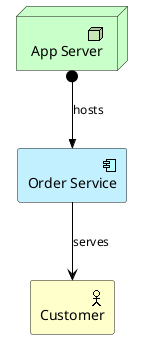

### Preprocessor
```plantuml
@startuml
!define ALERT #FF5555
!theme plain
!include <office/Servers/database_server>

!function $badge($t)
!return "<b>" + $t + "</b>"
!endfunction

!procedure $node($alias, $label)
  node "$label" as $alias
!endprocedure

$node(a, "Alpha")
$node(b, "Beta")
a -[ALERT]-> b : $badge("go")
@enduml
```
`!include <stdlib/path>` pulls from the bundled standard library (AWS, Azure, GCP, k8s, office, logos, tupadr3 icons). `!include URL` and `!includeurl` pull remote. `!define`/`!function`/`!procedure`/`!unquoted` build macros; `!if/!else/!endif`, `!foreach`, and `!$var = value` add logic.

## Supported Diagram Types (full enumeration)
Sequence · Class · Object · Use-case · Activity (beta start/stop) · Component · Deployment · State · Timing · Entity-Relationship (`entity`) · JSON (`@startjson`) · YAML (`@startyaml`) · Network (nwdiag) · Gantt (`@startgantt`) · Mindmap (`@startmindmap`) · WBS (`@startwbs`) · Salt GUI wireframe (`@startsalt`) · ArchiMate (stdlib) · plus stdlib-driven variants: AWS/Azure/GCP/Kubernetes architecture (icon sets), C4 (see `c4-plantuml.md`), and Regex/EBNF railroad.

## How-To (worked recipes)

### How to add colors, styling & themes
Three layers — inline colors, `skinparam`, and `!theme`:
```plantuml
@startuml
!theme cerulean
skinparam backgroundColor #F7F9FB
skinparam classAttributeIconSize 0
skinparam sequence {
  ArrowColor #2C3E50
  LifeLineBorderColor #7F8C8D
  ParticipantBackgroundColor #ECF0F1
}
participant A #line:black;back:LightYellow
participant B #AED6F1
A -[#red]-> B : error path
A -[#green,dashed]-> B : ok path
note right of B #gold : styled note
@enduml
```
Color forms: `#RRGGBB`, named colors (`LightBlue`, `tomato`), gradients `#red/orange` (top/bottom) or `#red-orange` (diagonal), and the combined `#line:black;back:#EEE;text:blue` selector. `skinparam` accepts global keys (`backgroundColor`, `shadowing false`, `defaultFontName`) and per-element blocks (`skinparam class { ... }`, `skinparam note { ... }`).

### How to pick and apply a bundled theme
```plantuml
@startuml
!theme aws-orange
Alice -> Bob : themed message
@enduml
```
Real bundled themes include: `plain`, `aws-orange`, `bluegray`, `black-knight`, `cerulean`, `cerulean-outline`, `crt-amber`, `crt-green`, `hacker`, `lightgray`, `mars`, `materia`, `materia-outline`, `metal`, `mimeograph`, `minty`, `sandstone`, `silver`, `sketchy`, `sketchy-outline`, `spacelab`, `superhero`, `toy`, `vibrant`, and the `reddress-*` / `bluegray` families. Use `!theme <name> from <url>` to load a custom theme file.

### How to control layout & direction
```plantuml
@startuml
left to right direction          ' flip use-case/component orientation
skinparam linetype ortho          ' right-angled edges (class/component)
Alice -[hidden]-> Bob             ' invisible edge to nudge ranking
Bob -down-> Carol                 ' hint edge direction: up/down/left/right
@enduml
```
`-up->`, `-down->`, `-left->`, `-right->` bias `dot` ranking. A `-[hidden]-` edge forces relative placement without drawing a line.

### How to reuse icons and sprites from the standard library
```plantuml
@startuml
!include <awslib/AWSCommon>
!include <awslib/Compute/EC2>
!include <awslib/Database/DynamoDB>
EC2(web, "Web Tier", "auto-scaled")
DynamoDB(tbl, "Sessions", "on-demand")
web --> tbl : reads/writes
@enduml
```
Browse namespaces under `<awslib/…>`, `<azure/…>`, `<gcp/…>`, `<kubernetes/…>`, `<office/…>`, `<logos/…>`, `<tupadr3/…>` (font-awesome/devicons). Define a custom sprite with `sprite $name { ... }` or `!include` a `.puml` sprite.

### How to render multiple diagrams from one file & embed generation
```plantuml
@startuml first
Alice -> Bob : one
@enduml

@startuml second
Bob -> Carol : two
@enduml
```
```bash
java -jar plantuml.jar -tsvg deck.puml   # emits first.svg and second.svg
```

## Do's and Don'ts

### ✅ Do
- Declare participants explicitly (`participant`, `actor`, `database`, …) before use so ordering and icons are deterministic.
- Alias long names once: `participant "Order Processing Service" as OPS` then reference `OPS`.
- Prefer the beta activity grammar (`start`/`stop`/`if`) — the legacy `(*)` syntax is deprecated and harder to read.
- Use `!theme` for global look and reserve inline `#color` for semantic highlights (error/success).
- Add `skinparam linetype ortho` and `-[hidden]-` edges to tame class/component layouts instead of fighting `dot`.
- Keep one diagram grammar per fence — do not mix sequence arrows with class relationships in the same `@startuml`.

### ❌ Don't
- Don't forget `@startuml`/`@enduml` — bare UML text renders nothing.
- Don't expect class/state/component diagrams to render without Graphviz `dot` installed; sequence/mindmap/gantt/salt/json/yaml do not need it, the rest do.
- Don't use spaces in an alias without quoting: `participant My Svc` breaks; use `participant "My Svc" as svc`.
- Don't rely on manual pixel positioning — PlantUML is auto-layout; steer with direction hints, ranks, and hidden edges, not coordinates.
- Don't put a real newline in a note when you mean a literal break — use `\n` inside the note text.
- Don't `!includeurl` untrusted remote files in automated pipelines; vendor the stdlib locally instead.

## Styling, Theming & Customization
- **`skinparam`** is the primary style engine: global (`skinparam backgroundColor`, `shadowing false`, `defaultFontName "Helvetica"`, `dpi 150`) and scoped blocks (`skinparam sequence { ArrowColor … }`, `skinparam state { … }`, `skinparam note { … }`, `skinparam class { BackgroundColor … }`).
- **`!theme`** applies a coordinated palette (see theme list above). `!theme name from <dir-or-url>` loads external themes.
- **Inline color selectors**: `#RRGGBB` / named / gradient (`#red/green`) / structured (`#line:...;back:...;text:...`). Edges take a bracketed style: `-[#red,dashed]->`, `-[#0000FF,bold]->`.
- **`<style>` blocks** (modern CSS-like styling) offer selector-based theming:
```plantuml
@startuml
<style>
  classDiagram {
    class { BackgroundColor #F0F8FF; LineColor #336699 }
    .critical { BackgroundColor #FFDDDD }
  }
</style>
class Payment <<critical>>
@enduml
```
- **Stereotype styling** via `<<tag>>` + `skinparam class<<tag>> { ... }` or the `.tag` selector in `<style>`.

## Advanced Features
- **Preprocessor macros / libraries**: `!function`, `!procedure`, `!include`, conditional `!if`, loops `!foreach`, variables `!$x`. Enables parameterized diagram factories.
- **Standard library icon sets**: AWS/Azure/GCP/Kubernetes/Office/FontAwesome/DevIcons for architecture diagrams.
- **Creole/HTML in text**: `<b>`, `<i>`, `<color:…>`, `<size:…>`, lists, and tables inside labels and notes.
- **`!pragma`** toggles (e.g. `!pragma layout smetana` for the pure-Java layout that avoids Graphviz for some diagrams).
- **Includes for reuse**: shared `!include common-skin.puml` across a doc set for consistent branding.
- **Exports**: `-tsvg`, `-tpng`, `-teps`, `-tpdf` (with extra libs), `-tlatex`, `-ttxt` (ASCII art), plus `-pipe` for stdin→stdout in CI.

## Common Pitfalls & Troubleshooting
- **Blank output / "Cannot find Graphviz"** — install Graphviz or try `!pragma layout smetana` for supported diagram types.
- **"Syntax Error?"** banner — usually a missing `@enduml`, an unquoted multi-word alias, or mixing two diagram grammars. Isolate by trimming to a minimal block.
- **Notes not breaking lines** — use `\n`, not a literal newline, inside single-line `note` text; or use the multi-line `note ... end note` form.
- **Version drift** — `@startuml` beta activity and `<style>` blocks require a reasonably recent engine (2020+). Pin the server/jar version in CI.
- **Huge diagrams truncated** — the public server enforces size limits; self-host or raise `PLANTUML_LIMIT_SIZE`.
- **Encoding** — save `.puml` as UTF-8; the online server also accepts a compressed `~1`-prefixed deflate encoding in the URL.

## Integration Notes
- **Markdown / docs**: GitLab, Gitea, Foswiki, AsciiDoc (`asciidoctor-diagram`), and MkDocs (`plantuml-markdown`) render fenced `plantuml` blocks server-side.
- **Confluence / Jira**: native PlantUML apps.
- **CI**: run `plantuml.jar` in a Docker step to emit SVGs as build artifacts.
- **Livebook/Kino**: see `kino-mermaid.md` for the Elixir-native diagram path; PlantUML is typically shelled out to the jar.

## Best For / Avoid For
`sequence-diagrams`, `class-diagrams`, `state-machines`, `er-models`, `architecture-docs`, `gantt`, `mindmaps`, `gui-wireframes`, `git-versioned-diagrams`, `stdlib-icon-architecture`

Avoid for: pixel-perfect hand-placed layouts, highly interactive/animated diagrams, or free-form illustration — reach for a drawing tool or D3/SVG instead. For C4 specifically, prefer the `c4-plantuml.md` macros; for full model-as-code C4 with multiple views, prefer `structurizr-dsl.md`.

## See Also
- [c4-plantuml.md](c4-plantuml.md) — C4 architecture macros layered on PlantUML
- [structurizr-dsl.md](structurizr-dsl.md) — model-as-code C4 with generated views
- [uml-xmi.md](uml-xmi.md) — interchange UML with modeling tools (XMI)
- [mermaid.md](mermaid.md) — browser-native diagram-as-code alternative
- [graphviz.md](graphviz.md) — the DOT layout engine PlantUML uses under the hood
- [../use-case/diagram-generation.md](../use-case/diagram-generation.md) — choosing a diagram solution
- [../use-case/engineering-diagrams.md](../use-case/engineering-diagrams.md) — engineering/architecture diagram patterns
